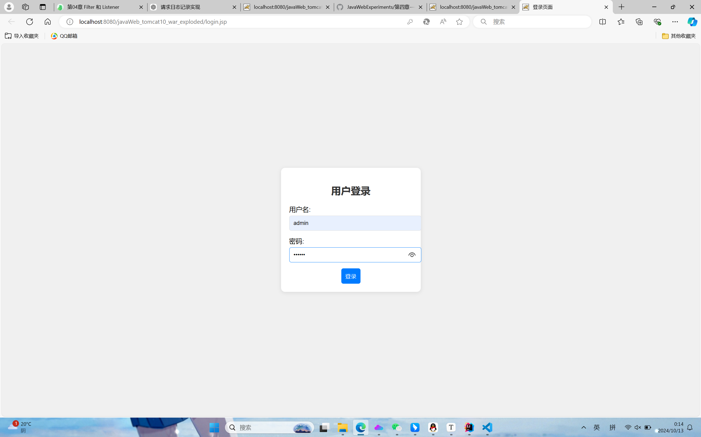
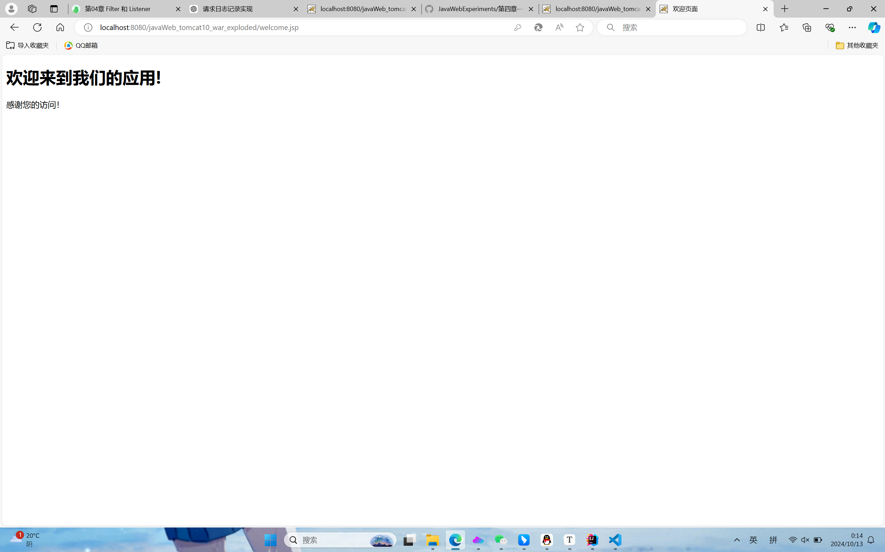
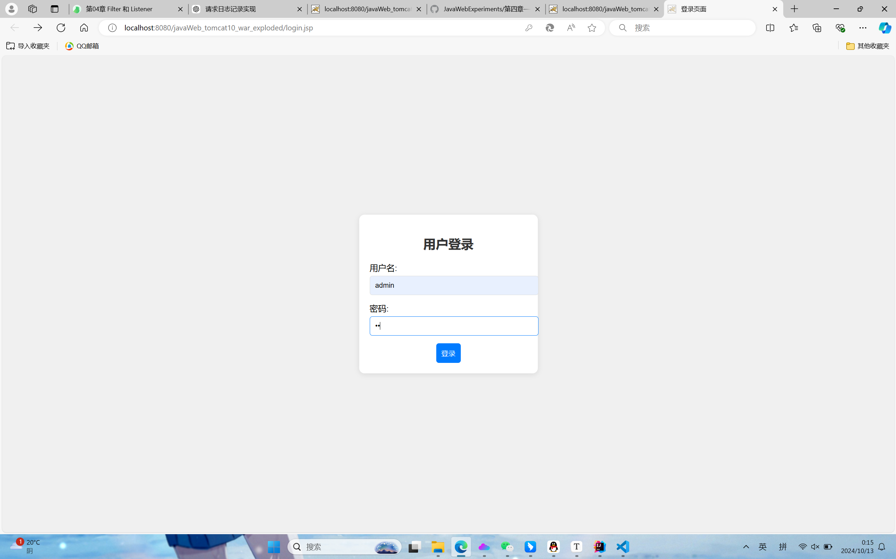
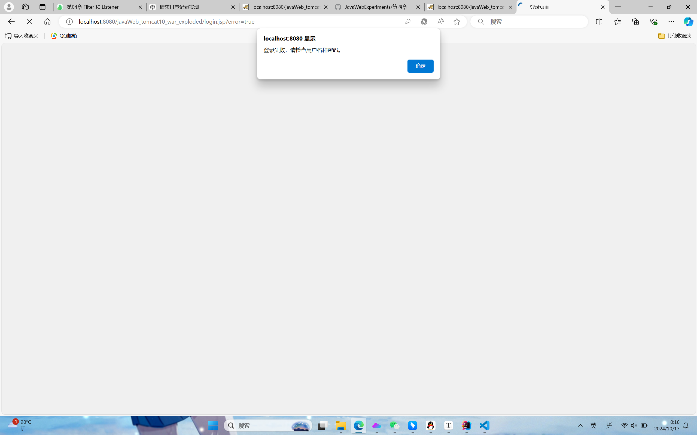
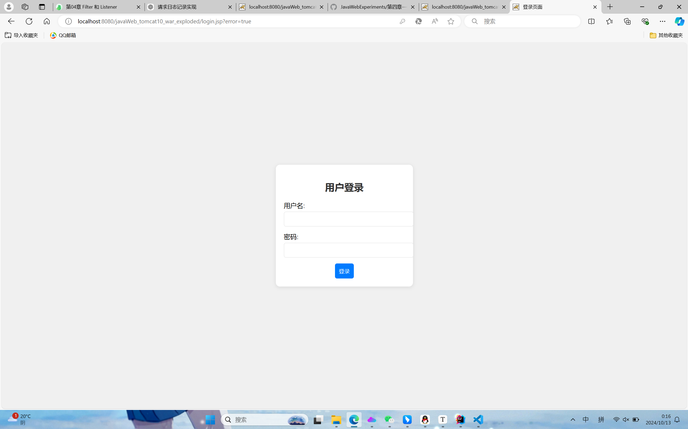

学院：省级示范性软件学院
课程：Java Web
题目：第四章作业一：Filter练习
姓名：李穗杰
学号：1977000019
班级：软工2201
日期：2024-10-12
实验环境： idea、tomcat10
实验目的：理解并掌握Filter
1. 创建一个名为 LoginFilter 的类, 实现 javax.servlet.Filter 接口。
2. 使用 @WebFilter 注解配置过滤器,使其应用于所有 URL 路径 ("/*")。
3. 在 doFilter 方法中实现以下逻辑: 
     a. 检查当前请求是否是对登录页面、注册页面或公共资源的请求。如果是,则允许请求通过。 
       b. 如果不是上述情况,检查用户的 session 中是否存在表示已登录的属性(如 "user" 属性)。
       c. 如果用户已登录,允许请求继续。 
       d. 如果用户未登录,将请求重定向到登录页面。
4. 创建一个排除列表,包含不需要登录就能访问的路径(如 "/login", "/register", "/public")。
5. 实现一个方法来检查当前请求路径是否在排除列表中。
6. 添加适当的注释,解释代码的主要部分。


代码login_filter.java:

```
package gzu.com.javaweb_tomcat10;

import jakarta.servlet.*;
import jakarta.servlet.annotation.WebFilter;
import jakarta.servlet.http.HttpServletRequest;
import jakarta.servlet.http.HttpServletResponse;
import jakarta.servlet.http.HttpSession;

import java.io.IOException;
import java.util.Arrays;
import java.util.List;

@WebFilter("/*")
public class login_filter implements Filter {
    // 定义不需要过滤的路径列表
    private static final List<String> EXCLUDED_PATHS = Arrays.asList("/login.jsp", "/loginServlet");

    @Override
    public void init(FilterConfig filterConfig) throws ServletException {
        // 初始化过滤器
    }
    
    @Override
    public void doFilter(ServletRequest servletRequest, ServletResponse servletResponse, FilterChain filterChain) throws IOException, ServletException {
        HttpServletRequest request = (HttpServletRequest) servletRequest;
        HttpServletResponse response = (HttpServletResponse) servletResponse;
    
        String requestURI = request.getRequestURI();
    
        // 检查用户的 session 是否包含 "user" 属性，表明用户已登录
        HttpSession session = request.getSession(false);
    
        // 检查请求路径是否在排除列表中
        if (isExcludedPath(requestURI)) {
            // 如果请求路径在排除列表中，允许请求通过
            filterChain.doFilter(request, response);
            return;
        }
    
        if (session != null && session.getAttribute("user") != null) {
            // 用户已登录，允许请求通过
            filterChain.doFilter(request, response);
        } else {
            // 用户未登录，重定向到登录页面
            response.sendRedirect(request.getContextPath() + "/login.jsp");
        }
    }
    
    // 方法：检查当前请求路径是否在排除列表中
    private boolean isExcludedPath(String requestURI) {
        return EXCLUDED_PATHS.stream().anyMatch(requestURI::endsWith);
    }

}
```

文字说明：
@WebFilter("/*")将该filter作用于所有路径。
接着设定了不需要过滤的路径，若请求路径在 EXCLUDED_PATHS 中，则通过执行filterChain.doFilter(request, response);放行请求，以便进入到用户登录界面。
之后初始化filter，并对每次访问其他路径执行doFilter方法。
每一次重定位路径时需要检查用户的session是否包含 "user" 属性（代码体现：if (session != null && session.getAttribute("user") != null) ），有则表示，表明用户已登录，执行filterChain.doFilter(request, response);放行请求。
若用户未登录，重定向到登录页面response.sendRedirect(request.getContextPath() + "/login.jsp");
同时我们需要一个方法来判断路径是否在EXCLUDED_PATHS中，代码为：
private boolean isExcludedPath(String requestURI) {
        return EXCLUDED_PATHS.stream().anyMatch(requestURI::endsWith);
}


演示：
登陆注册的servlet，login_servlet.java:

```
package gzu.com.javaweb_tomcat10;

import jakarta.servlet.ServletException;
import jakarta.servlet.annotation.WebServlet;
import jakarta.servlet.http.HttpServlet;
import jakarta.servlet.http.HttpServletRequest;
import jakarta.servlet.http.HttpServletResponse;
import jakarta.servlet.http.HttpSession;

import java.io.IOException;

@WebServlet("/loginServlet")
public class login_servlet extends HttpServlet {
    @Override
    protected void doPost(HttpServletRequest req, HttpServletResponse resp) throws ServletException, IOException {
        String username = req.getParameter("username");
        String password = req.getParameter("password");

        // 简单的登录验证逻辑
        if ("admin".equals(username) && "123456".equals(password)) {
            HttpSession session = req.getSession();
            session.setAttribute("user", username); // 用户登录成功，设置 session 属性
            resp.sendRedirect(req.getContextPath() + "/welcome.jsp"); // 登录成功后重定向
        } else {
            // 登录失败，重定向回登录页面，并带上错误参数
            resp.sendRedirect(req.getContextPath() + "/login.jsp?error=true");
        }
    }

}
```

文字说明：
该servlet实现了捕获用户提交的用户密码
        String username = req.getParameter("username");
        String password = req.getParameter("password");
之后简单的判断了用户密码是否正确，正确则跳转到welcome.jsp。
    resp.sendRedirect(req.getContextPath() + "/welcome.jsp"); 
否则，回到登陆页面，并带上错误参数。
resp.sendRedirect(req.getContextPath() + "/login.jsp?error=true");


代码login.jsp:

```
<%@ page language="java" contentType="text/html; charset=UTF-8" pageEncoding="UTF-8"%>

<!DOCTYPE html>
<html lang="zh-CN">
<head>
    <meta charset="UTF-8">
    <meta name="viewport" content="width=device-width, initial-scale=1.0">
    <title>登录页面</title>
    <style>
        body {
            font-family: Arial, sans-serif;
            background-color: #f0f0f0;
            display: flex;
            justify-content: center;
            align-items: center;
            height: 100vh;
            margin: 0;
            animation: fadeIn 1s ease-in-out;
        }


        .container {
            background-color: white;
            padding: 20px;
            border-radius: 10px;
            box-shadow: 0 2px 10px rgba(0, 0, 0, 0.1);
            width: 300px;
            text-align: center;
            animation: slideIn 0.5s ease-in-out;
        }
    
        h2 {
            margin-bottom: 20px;
            color: #333;
        }
    
        label {
            display: block;
            margin-bottom: 5px;
            text-align: left;
        }
    
        input[type="text"], input[type="password"] {
            width: 100%;
            padding: 10px;
            margin-bottom: 15px;
            border: 1px solid #ddd;
            border-radius: 5px;
            transition: border 0.3s ease;
        }
    
        input[type="text"]:focus, input[type="password"]:focus {
            border: 1px solid #007bff;
            outline: none;
        }
    
        input[type="submit"] {
            background-color: #007bff;
            color: white;
            padding: 10px;
            border: none;
            border-radius: 5px;
            cursor: pointer;
            transition: background-color 0.3s ease;
        }
    
        input[type="submit"]:hover {
            background-color: #0056b3;
        }
    
        @keyframes fadeIn {
            from {
                opacity: 0;
            }
            to {
                opacity: 1;
            }
        }
    
        @keyframes slideIn {
            from {
                transform: translateY(-20px);
                opacity: 0;
            }
            to {
                transform: translateY(0);
                opacity: 1;
            }
        }
    </style>
    <script>
        // 检查 URL 中是否包含错误参数
        window.onload = function() {
            const urlParams = new URLSearchParams(window.location.search);
            if (urlParams.get('error') === 'true') {
                alert('登录失败，请检查用户名和密码。');
            }
        };
    </script>

</head>
<body>

<div class="container">
    <h2>用户登录</h2>
    <form action="loginServlet" method="post">
        <label for="username">用户名:</label>
        <input type="text" id="username" name="username" required>
        <label for="password">密码:</label>
        <input type="password" id="password" name="password" required>
        <input type="submit" value="登录">
    </form>
</div>

</body>
</html>
```


代码welcom.jsp:

```
<%@ page language="java" contentType="text/html; charset=UTF-8" pageEncoding="UTF-8"%>

<!DOCTYPE html>
<html lang="zh-CN">
<head>
    <meta charset="UTF-8">
    <meta name="viewport" content="width=device-width, initial-scale=1.0">
    <title>欢迎页面</title>
</head>
<body>
<h1>欢迎来到我们的应用!</h1>
<p>感谢您的访问！</p>
</body>
</html>
```


运行展示：
输入正确的账号密码

来到了welcom.jsp

输入错误的账号密码

带着错误的信息回到登陆界面




总结：
困难在于理解filter工作原理，清楚的知道过滤器拦截的是什么，否则就像我一开始一直报错404.
在询问丁老师之后才明白，一般情况filter拦截静态的请求，例如登陆注册。

在吸取经验之后，在以后的课程之中，认真听取理论知识，了解原理，才能更好的完成实践。