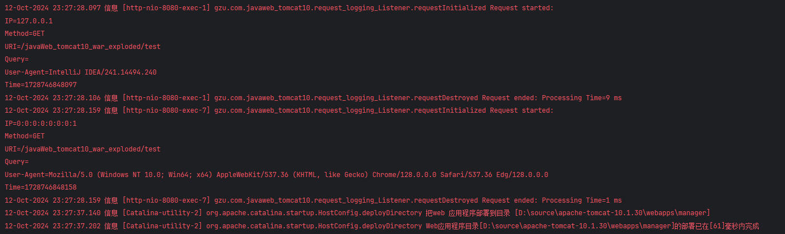

学院：省级示范性软件学院
课程：Java Web
题目：第四章作业二：Listener练习
姓名：李穗杰
学号：1977000019
班级：软工2201
日期：2024-10-12
实验环境： idea、tomcat10
实验目的：理解并掌握Listener
实验内容：
1. 实现一个 ServletRequestListener 来记录每个 HTTP 请求的详细信息。
2. 记录的信息应包括但不限于：
    ○ 请求时间
    ○ 客户端 IP 地址
    ○ 请求方法（GET, POST 等）
    ○ 请求 URI
    ○ 查询字符串（如果有）
    ○ User-Agent
    ○ 请求处理时间（从请求开始到结束的时间）
3. 在请求开始时记录开始时间，在请求结束时计算处理时间。
4. 使用适当的日志格式，确保日志易于阅读和分析。
5. 实现一个简单的测试 Servlet，用于验证日志记录功能。
6. 提供简要说明，解释你的实现方式和任何需要注意的事项。

代码request_logging_Listener.java：

```

package gzu.com.javaweb_tomcat10;

import jakarta.servlet.ServletRequestEvent;
import jakarta.servlet.ServletRequestListener;
import jakarta.servlet.annotation.WebListener;
import jakarta.servlet.http.HttpServletRequest;

import java.util.logging.Logger;

@WebListener
public class request_logging_Listener implements ServletRequestListener{
    private static final Logger logger = Logger.getLogger(request_logging_Listener.class.getName());

    @Override
    public void requestInitialized(ServletRequestEvent sre) {
        HttpServletRequest request = (HttpServletRequest) sre.getServletRequest();
    
        // 获取请求详细信息
        String ipAddress = request.getRemoteAddr();
        String method = request.getMethod();
        String uri = request.getRequestURI();
        String queryString = request.getQueryString() != null ? request.getQueryString() : "";
        String userAgent = request.getHeader("User-Agent");
    
        // 记录开始时间
        long startTime = System.currentTimeMillis();
        request.setAttribute("startTime", startTime);
    
        // 日志记录开始请求
        logger.info(String.format(
                "Request started:%n" +  // 换行
                        "IP=%s%n" +             // 换行
                        "Method=%s%n" +          // 换行
                        "URI=%s%n" +             // 换行
                        "Query=%s%n" +           // 换行
                        "User-Agent=%s%n" +      // 换行
                        "Time=%d",
                ipAddress, method, uri, queryString, userAgent, startTime
        ));
    }
    
    @Override
    public void requestDestroyed(ServletRequestEvent sre) {
        HttpServletRequest request = (HttpServletRequest) sre.getServletRequest();
    
        // 获取开始时间
        long startTime = (long) request.getAttribute("startTime");
        long endTime = System.currentTimeMillis();
        long processingTime = endTime - startTime;
    
        // 日志记录请求结束
        logger.info(String.format("Request ended: Processing Time=%d ms", processingTime));
    }

}
```

文字说明：
创建一个类request_logging_Listener去实现ServletRequestListener
通过实现Listener的两个方法requestInitialized、requestDestroyed来监听 HTTP 请求的生命周期，并记录请求的相关信息。

requestInitialized：
当服务器接收到一个新的 HTTP 请求时，容器会调用 requestInitialized() 方法，意味着此时请求刚刚开始。
之后通过 HttpServletRequest 对象，我们可以提取请求的详细信息。
通过System.currentTimeMillis() 获取当前系统的时间戳，并将其存储为请求的开始时间。使用 request.setAttribute("startTime", startTime) 把这个时间戳附加到请求对象上，以便稍后计算运行时间使用。
利用 Logger 类将这些信息记录下来。日志包括了 IP 地址、请求方法、URI、查询字符串、User-Agent 和请求的开始时间，将他们打印出来。

requestDestroyed：
当请求被处理完成并即将销毁时，容器会自动调用 requestDestroyed() 方法。这时，意味着服务器对请求的处理工作已完成。
计算请求的处理时间：
通过 request.getAttribute("startTime") 获取请求开始时存储的时间戳。
再次调用 System.currentTimeMillis() 来获取当前时间，作为请求的结束时间。
通过 endTime - startTime 计算处理时间，这样你就可以知道从请求开始到结束所用的时间，单位为毫秒。
最后再次使用 Logger 记录请求的结束时间，并输出处理时间。这部分日志是补充上半部分日志中的处理时间信息。

演示：
代码test_servlet.java:

```
package gzu.com.javaweb_tomcat10;

import jakarta.servlet.ServletException;
import jakarta.servlet.annotation.WebServlet;
import jakarta.servlet.http.HttpServlet;
import jakarta.servlet.http.HttpServletRequest;
import jakarta.servlet.http.HttpServletResponse;

import java.io.IOException;

@WebServlet("/test")
public class test_servlet extends HttpServlet {
    @Override
    protected void doGet(HttpServletRequest req, HttpServletResponse resp) throws ServletException, IOException {
        resp.getWriter().println("Testing RequestLoggingListener...");
    }

    @Override
    protected void doPost(HttpServletRequest req, HttpServletResponse resp) throws ServletException, IOException {
        doGet(req, resp);
    }

}
```

运行结果：



总结：
监听器的工作流程：
当请求到来时：容器接收到 HTTP 请求，调用 requestInitialized() 方法。此时，监听器获取请求的详细信息并记录请求的开始时间。
处理请求期间：请求经过各种 Servlet、过滤器或其他处理组件处理，直至服务器准备返回响应给客户端。
请求结束时：请求处理完毕，容器调用 requestDestroyed()。此时，监听器计算并记录从请求开始到结束的处理时间，并输出日志。

监听器的优势
无侵入性：使用 ServletRequestListener 可以在不修改业务逻辑的情况下，自动捕获每个请求的生命周期事件。只要配置好监听器，它就会自动执行。
全面的请求监控：可以监控所有 HTTP 请求的生命周期，包括请求开始、结束、耗时等。这对性能分析、调试和日志记录非常有帮助。
适用场景
性能监控：可以通过记录每个请求的处理时间，分析应用的性能瓶颈。
安全性日志：记录请求的 IP 地址、User-Agent 等信息，有助于进行安全性审计和分析。
调试：可以帮助开发者快速定位请求的具体情况，了解系统的负载和性能表现。
通过实现 ServletRequestListener，能够为每个 HTTP 请求建立起详细的日志跟踪系统，帮助监控和分析应用程序的行为。