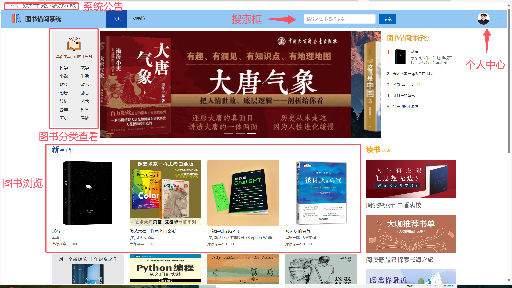

# 《在线图书馆管理系统用户手册》

> 学院：省级示范性软件学院
> 课程：Java Web后端开发技术
> 题目：《JavaWeb 期末综合项目:在线图书馆管理系统》
> 姓名：李穗杰
> 学号：1977000019
> 班级：软工2201
> 日期：2024-12-9
> 项目环境： MySQL、idea、SpringBoot+ mybatisplus + jwt、vue

[TOC]

## 一、引言
### 1.1 编写目的
>本手册为在线图书管理系统用户手册，专为在线图书管理系统的广大用户编写，旨在提供全面且细致的操作指南。通过本手册，读者能够深入了解在线图书管理系统的各项功能，并学会如何在系统中进行高效操作，例如进行图书查询、借阅与归还操作、管理个人借阅信息、查看系统公告等。本手册将引领用户熟悉在线图书管理系统的使用流程，确保每一位用户都能获得顺畅、满意的操作体验。同时也为图书管理员提供详细的操作指南。
## 二、软件概述
### 2.1 用户功能概述
- **1. 用户登录**
- **2. 用户注册**
- **3. 用户信息管理**
- **4. 查看系统首页，图书搜素以及系统公告**
- **5. 图书分类浏览**
- **6. 图书详情界面**
- **7. 书单使用**
- **8. 图书借阅**
- **9. 逾期查看**
### 2.2 管理员功能概述
- **1. 管理员登录**
- **2. 管理员信息管理**
- **3. 系统公告**
- **4. 图书管理**
- **5. 借阅订单的审核**
- **6. 用户信息的管理**
### 2.2 管理员功能概述
## 三、运行环境
### 3.1 硬件
>在线图书管理系统可在支持现代Web技术的服务器上运行，无需特定硬件要求，但需确保服务器能够稳定运行PHP、MySQL服务以及Web服务。
### 3.2 支持软件及客户端程序
>GOGO商城系统支持多种浏览器，以确保用户无论使用何种浏览器都能获得良好的购物体验：支持Internet Explorer 8至Internet Explorer 10版本的浏览器，以及其他使用IE内核或IE兼容模式的浏览器。对于Internet Explorer 11浏览器，用户可能需要将GOGO商城系统添加到兼容性视图设置中，以确保所有功能正常运行。系统经过优化，以支持最新的谷歌Chrome和Mozilla  irefox浏览器，但请注意，部分老旧版本的浏览器可能存在兼容性问题，影响部分功能的使用。我们推荐用户使用最新版本的浏览器，以获得最佳的用户体验和系统性能。
## 四、使用说明
### 4.1 用户使用说明
#### 4.1.1首页介绍（图书浏览、图书搜索以及系统公告）
>用户可通过首页浏览图书、查看系统公告、搜索图书、分类查看图书以及查看个人中心。

#### 4.1.2 登录
>用户可通过登陆界面输入正确的用户名、密码以及身份，点击登录即可进入用户首页。

#### 4.1.3 注册
>用户可通过注册界面输入用户名、密码、再次确认密码创建用户账号，需要注意密码、再次确认密码需一样。

#### 4.1.4 个人信息管理
>用户可通过注册界面输入用户名、密码、再次确认密码创建用户账号，需要注意密码、再次确认密码需一样。

#### 4.1.5 查看图书详情
>用户可通过点击图书图片进入图书详情界面。可以查看图书名称、简介、作者、出版社、出版日期、ISBN、零售价、剩余库存。
>并且下方有”立即借阅“、”加入书单“按钮

#### 4.1.6 图书借阅
>用户在图书详情界面可点击”立即借阅“，并且该按钮左侧可以选择借阅数量。
>用户在借阅之后，可以在”我的借书“中查看借阅订单情况。如图，点击”立即借阅“后订单状态为”借书待确认“，该状态需要等待管理员审核通过，状态变为”已借出“，才为真正借出图书。用户也可点击”取消“，将订单状态更改为”已取消“，以取消借书。当借出之后，用户可以点击”归还“按钮，将订单状态更改为还书待确认。若管理员通过还书申请，状态更改为”已归还“，此时图书真正归还。

#### 4.1.7 借阅状态的查看
>用户可在”我的借书“中查看个人的借阅订单，可以查看借阅状态

#### 4.1.8 逾期提醒
>用户可在”我的借书“中查看借出天数，若超过30天，则借出天数的数字加粗变红，提醒用户逾期。

#### 4.1.9 图书分类浏览
>用户可在首页或者图书馆的分类导航栏中，点击图书分类以查看对应分类的图书。

#### 4.1.10 书单使用
>书单功能类似于购物车，可将多本图书放入书单，之后一同借阅，其余操作同图书借阅。

### 4.2 管理员使用说明
#### 4.2.1 登录
>管理员可通过登陆界面输入正确的用户名、密码以及身份，点击登录即可进入后台首页。

#### 4.2.2 信息管理
>管理员可通过个人信息界面，来更改个人信息。

#### 4.2.3 系统公告
>管理员可点击图中按钮，以增删改查公告信息。

#### 4.2.4 图书管理
>管理员可通过图书信息，来管理图书，可对图书进行增删改查操作。

#### 4.2.5 审核借阅订单
>管理员可在借书订单中审核用户的借阅订单，可对”借书待确认“订单点击”确认借出“按钮，将订单状态变为”已借出“。可对”还书待确认“订单点击”确认还书“按钮，将订单状态变为”已归还“。

#### 4.2.6 管理用户信息
>管理员可以管理用户的信息，对用户账号进行增删改查。

