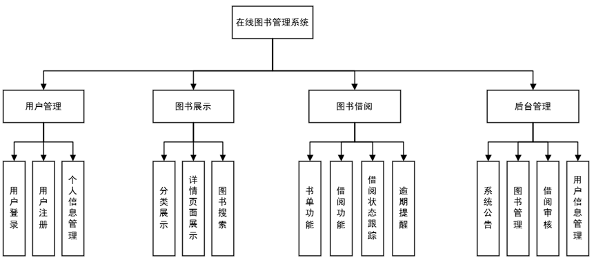

# 《在线图书馆管理系统设计文档》


> 学院：省级示范性软件学院
> 课程：Java Web后端开发技术
> 题目：《JavaWeb 期末综合项目:在线图书馆管理系统》
> 姓名：李穗杰
> 学号：1977000019
> 班级：软工2201
> 日期：2024-12-2
> 项目环境： MySQL、idea、SpringBoot+ mybatisplus + jwt、vue

[TOC]

# 第一章在线图书管理系统架构设计
## 1.1 架构模式
本系统采用分层架构模式，主要分为表现层、业务逻辑层、数据访问层和数据持久层。
1. **表现层**：
    - 负责与用户进行交互，接收用户的输入并展示系统的输出。主要使用 Vue.js 框架构建用户界面，通过 API请求 与后端进行数据交互，实现页面的动态渲染和数据展示。例如，用户在前端页面进行图书搜索、查看图书详情、提交借阅申请等操作时，表现层负责将这些操作请求发送给业务逻辑层，并将业务逻辑层返回的数据以友好的界面形式展示给用户。
2. **业务逻辑层**：
    - 处理系统的核心业务逻辑，是连接表现层和数据访问层的桥梁。使用 Spring Boot 框架开发，实现诸如用户注册与登录验证、图书借阅与归还规则处理、用户信息管理、图书分类与检索逻辑等业务功能。
    - 例如，在处理图书借阅业务时，业务逻辑层会先验证用户的借阅资格（如信誉分是否足够，库存数量是否足够等），然后调用数据访问层的相关方法对图书库存和用户借阅信息进行更新操作。
3. **数据访问层**：
    - 定义与数据持久层交互的接口和方法，隔离业务逻辑层与具体的数据存储实现细节。基于 MyBatis Plus 框架，提供对数据库的高效访问操作，如数据的增删改查等。
    - 例如，数据访问层会定义获取图书信息的接口方法，业务逻辑层通过调用该方法获取图书数据，而数据访问层内部则将其转换为对数据库的具体查询操作，并将查询结果返回给业务逻辑层。
4. **数据持久层**：
    - 负责数据的持久化存储，采用 MySQL 关系型数据库管理系统存储图书信息、用户信息、借阅记录等数据。通过 JDBC 技术与数据库建立连接，确保数据的安全存储和高效读取。

## 1.2 模块架构
系统设计模块如图所示

1. **用户管理模块**：
    - 此模块专注于用户相关信息与操作的处理。用户可进行注册，填写基本资料创建账号，之后能随时登录。登录后可修改密码、更新个人信息，如头像、姓名、电话、邮箱等。系统依据用户借阅行为评定信誉分，信誉分会影响借阅权限。同时，用户可查看自己的借阅历史，包括借阅日期、归还日期、所借图书详情等，方便回顾阅读轨迹与管理个人借阅事务。
2. **图书展示模块**：
    - 主要用于向用户呈现丰富的图书资源。它按照多种分类方式展示图书，如按学科类别、是否推荐、是否上架等，方便用户快速定位目标图书。每本图书都有详细的信息展示，涵盖书名、作者、出版社、出版年份、内容简介、封面图片等内容，让用户能充分了解图书概况。还具备强大的搜索功能，支持用户依据书名进行精准搜索，搜索结果精准呈现，提升用户查找图书的效率，激发用户的阅读兴趣与探索欲。
3. **图书借阅模块**：
    - 图书借阅模块是实现图书借阅流程的核心部分。用户在浏览图书展示模块后，可将心仪图书加入书单，提交借阅订单。系统自动检查用户借阅资格，如是否有逾期未还图书等。若符合条件，再由管理员通过，系统记录借阅时间并设定归还期限。临近归还期限时，通过逾期提醒督促用户按时归还。若用户逾期未还，将依据规定扣除信誉分，限制其借阅功能，确保图书能在规定时间内流转，提高图书利用率，保障广大用户的借阅权益。
4. **后台管理模块**：
    - 主要面向管理员，承担系统整体运营管理的重任。在图书管理方面，管理员可进行图书信息录入，包括新书上架的详细信息添加，以及对现有图书信息的修改，如价格调整、库存更新等，还能删除下架图书信息，并对图书分类进行创建与调整，优化图书资源的组织架构。在用户管理上，可查看所有用户信息，审核用户注册申请，处理用户账号异常情况。同时，能对系统的借阅规则进行设定与修改，如借阅期限、借阅数量上限、逾期费用标准等，还可查看系统运行数据报表，了解图书借阅频率、热门图书排行等信息，为图书馆资源调配与服务优化提供数据支撑，保障系统稳定、高效运行。

## 1.3 技术集成
1. **前后端集成**：
    - 前端 Vue.js 与后端 Spring Boot 通过 RESTful API 进行集成。前端页面的交互操作通过 API请求 发送 HTTP 请求到后端的相应 API 接口，后端接收请求后进行业务处理，并将处理结果以 JSON 格式返回给前端。例如，用户在前端点击借阅图书按钮后，前端发送借阅请求到后端的借阅管理模块对应的 API，后端处理后返回借阅成功或失败的信息给前端进行展示。
2. **数据库集成**：
    - 通过 MyBatis Plus 框架实现与 MySQL 数据库的集成。MyBatis Plus 简化了数据库操作，在数据访问层中，开发人员只需定义接口方法，MyBatis Plus 会自动生成相应的 SQL 语句并执行数据库操作。例如，在图书管理模块的数据访问层接口中定义了查询图书信息的方法，MyBatis Plus 会根据方法名和参数自动生成查询 SQL 并从 MySQL 数据库中获取图书数据。

## 1.4 性能、可靠性和扩展性设计
1. **性能设计**：
    - 在数据库层面，合理设计表结构，为频繁查询的字段创建索引，如在图书表中为书名字段创建索引，以提高图书查询速度。采用数据库连接池技术，减少数据库连接创建和销毁的开销，提高数据库访问效率。
2. **可靠性设计**：
    - 采用数据备份与恢复策略，定期对 MySQL 数据库进行全量和增量备份，将备份数据存储在不同的物理位置，以防止数据丢失。例如，每天进行一次全量备份，每小时进行一次增量备份。
    - 实现系统的容错机制，在业务逻辑层和数据访问层对可能出现的异常进行捕获和处理，如数据库连接异常、逻辑错误异常等，确保系统在出现局部故障时仍能保持部分功能的正常运行。
3. **扩展性设计**：
    - 在架构设计上，采用分层和模块化的设计思想，使得各个模块之间的耦合度较低，便于在未来进行功能扩展。例如，如果需要增加电子图书借阅功能，只需在图书管理模块和借阅管理模块中添加相应的子模块，并与现有模块进行集成即可。
    - 数据库设计考虑到数据量的增长，采用分库分表技术。例如，当图书数量超过一定规模时，可以按照图书分类或其他规则将图书数据分布到不同的数据库表中，提高数据库的查询和存储性能。
    - 技术选型上，选择具有良好扩展性的技术框架和工具。如 Spring Boot 框架提供了丰富的插件和扩展机制，方便在系统发展过程中集成新的技术和功能；MyBatis Plus 也支持多种数据库方言，便于在需要更换数据库时进行切换。 

# 第二章数据库设计
## 2.1 数据库设计目的
1. **精准存储与管理各类核心数据。**：
面涵盖图书信息，包括书名、作者、出版社、出版年份、ISBN 号、图书分类、价格、库存数量、简介等，确保每本图书的详细资料得以完整记录，为图书展示、查询与借阅业务提供数据源泉。同时，妥善存储用户信息，如用户名、密码、真实姓名、性别、联系方式、电子邮箱、注册时间、信誉分等，便于用户管理、身份验证、权限判定以及个性化服务的开展。此外，对借阅记录进行详细登记，记录借阅时间、归还时间、借阅图书 ID、借阅用户 ID 等信息，实现借阅流程的有效跟踪与管理，为逾期处理、数据分析提供依据。
2. **保障数据的完整性与一致性**：
通过合理设定数据约束，如主键约束确保每条记录的唯一性，外键约束维护表间关联关系的正确性，非空约束保证关键数据的必填性等，防止非法或错误数据进入数据库。例如，在借阅记录表中，通过外键关联图书表和用户表，确保借阅操作对应的图书和用户信息真实有效，避免数据冲突与不一致现象的发生，维护系统数据的准确性与可靠性。
3. **优化数据检索与查询性能**：
依据业务需求与数据特点，精心设计表结构与索引。例如，为图书表中的书名、作者、图书分类等经常用于查询筛选的字段创建索引，显著提高图书搜索的速度，使用户能够快速定位到心仪图书。在处理复杂查询时，如查询某一时间段内某类图书的借阅情况，合理的数据库结构与索引能够减少数据扫描范围，加速查询结果的返回，提升系统响应效率，为用户提供流畅的操作体验。
4. **满足系统的可扩展性需求**：
考虑到未来业务的发展与变化，如新增图书类型、拓展用户服务功能、与其他系统进行数据交互等，数据库设计采用灵活的架构与规范。预留适当的数据字段与表空间，以便在不影响现有系统运行的前提下，方便地添加新的数据元素与表结构。例如，在图书分类表中，设计可扩展的分类字段，当引入新的分类维度时能够轻松进行数据更新与结构调整，确保数据库能够适应系统长期发展的需求，降低因业务变更而导致的数据库重构成本。

## 2.2 数据库的概念结构设计
>数据库概念结构设计旨在依据在线图书借阅系统的功能需求，梳理出系统涉及的核心实体以及它们之间的相互关系，构建起科学合理的数据模型，为后续具体的数据库表结构设计奠定基础。基于本系统需求，数据库主要包含以下几个关键实体：admin,book,cart,category,notice,orders,orders_item,user。
1. **admin**：
管理员（admin）表实体包括管理员 id、账号、密码、姓名、头像、角色、电话、邮箱。其中管理员 id 在数据库中设计为唯一标识。

2. **book**：
图书（book）表实体包括图书 id、名称、封面、简介、作者、出版社、出版日期、价格、ISBN、库存、分类 ID、是否上架、是否推荐。其中图书 id 在数据库中设计为唯一标识。

3. **cart**：
书单（cart）表实体包括书单 id、图书 ID、数量、用户 ID、添加日期。其中书单 id 在数据库中设计为唯一标识。

4. **category**：
图书分类（category）表实体包括分类 id、分类名称。其中分类 id 在数据库中设计为唯一标识。

5. **notice**：
系统公告（notice）表实体包括主键 ID、公告标题、公告内容、发布时间。其中主键 ID 在数据库中设计为唯一标识。

6. **orders**：
订单（orders）表实体包括订单 ID、书籍名称、借书编号、借书时间、用户 ID、状态。其中订单 ID 在数据库中设计为唯一标识。

7. **orders_item**：
订单明细（orders_item）表实体包括订单明细 ID、图书 ID、图书名称、图书封面、数量、借书订单 ID。其中订单明细 ID 在数据库中设计为唯一标识。

8. **user**：
普通用户（user）表实体包括主键 ID、账号、密码、姓名、头像、角色、电话、邮箱、信誉分。其中主键 ID 在数据库中设计为唯一标识。

9. **数据库实体关系 E-R 图**：
>1. **用户（user）表和书单（cart）表**
>    - 一对多关系。一个用户可以拥有多个书单记录（比如用户可能在不同时间添加图书到书单），而一个书单记录只属于一个用户。通过书单表中的“user_id”字段与用户表的“id”字段建立关联来体现这种关系。
>2. **用户（user）表和订单（orders）表**
 >   - 一对多关系。一个用户可以产生多个订单，而一个订单只对应一个用户。在订单表中的“user_id”字段关联到用户表的“id”字段，用于表示这种所属关系。
>3. **图书（book）表和书单（cart）表**
 >   - 多对多关系。一本图书可以被多个用户添加到书单，一个书单也可以包含多本图书。通过书单表中的“book_id”字段与图书表的“id”字段建立联系来表示这种复杂的关系。
>4. **图书（book）表和订单（orders）表、订单明细（orders_item）表**
>   - 图书和订单是多对多关系。一本图书可以出现在多个订单中，一个订单可以包含多本图书。这种关系通过订单明细（orders_item）表来间接体现，订单明细表中的“book_id”关联图书表的“id”，“order_id”关联订单表的“id”，从而建立起图书与订单之间的多对多联系。
>5. **图书（book）表和图书分类（category）表**
>    - 多对一关系。多本图书可以属于同一个图书分类，而一个图书分类包含多本图书。在图书表中的“category_id”字段关联图书分类表的“id”字段，用于确定图书所属的分类。
>6. **订单（orders）表和订单明细（orders_item）表**
>    - 一对多关系。一个订单包含多个订单明细，每个订单明细只属于一个订单。通过订单明细表中的“order_id”字段与订单表的“id”字段建立关联来体现这种关系。
>7. **管理员（admin）表和其他表（如图书、订单、系统公告等）**
>    - 一对多关系。一个管理员可以管理多本图书（对图书进行添加、修改、删除等操作）、多个订单（审核订单等）和多条系统公告（发布公告）等。具体关联字段根据不同的业务操作而定，例如管理员在管理图书时，是通过在图书表中可能的管理字段（如记录操作管理员的字段，这里暂未明确）或者后台权限控制来关联管理员表中的“id”字段。系统公告表中的公告发布可能会有一个字段关联管理员表的“id”，以表明公告是由哪个管理员发布的。
>     实体E-R图如下图所示
>     

## 2.3 数据库的逻辑设计
数据库的逻辑设计主要是设计数据库中各实体的关系表。
### 1. **admin关系表**
该表将用于识别用户登陆时的身份，如果是admin则进入后台界面
| 字段名    | 类型                          | 是否为空 | 默认值 | 注释     |
|-----------|-------------------------------|----------|--------|----------|
| id        | int                           | 否       | 自动增长 | 主键ID  |
| username  | varchar(255) CHARACTER SET utf8mb4 COLLATE utf8mb4_unicode_ci | 是       | NULL   | 账号     |
| password  | varchar(255) CHARACTER SET utf8mb4 COLLATE utf8mb4_unicode_ci | 是       | NULL   | 密码     |
| name      | varchar(255) CHARACTER SET utf8mb4 COLLATE utf8mb4_unicode_ci | 是       | NULL   | 姓名     |
| avatar    | varchar(255) CHARACTER SET utf8mb4 COLLATE utf8mb4_unicode_ci | 是       | NULL   | 头像     |
| role      | varchar(255) CHARACTER SET utf8mb4 COLLATE utf8mb4_unicode_ci | 是       | NULL   | 角色     |
| phone     | varchar(255) CHARACTER SET utf8mb4 COLLATE utf8mb4_unicode_ci | 是       | NULL   | 电话     |
| email     | varchar(255) CHARACTER SET utf8mb4 COLLATE utf8mb4_unicode_ci | 是       | NULL   | 邮箱     |

### 2. **book关系表**：
该表用于存储书籍，与借阅、图书相关联
| 字段名       | 类型                          | 是否为空 | 默认值 | 注释         |
|--------------|-------------------------------|----------|--------|--------------|
| id           | int                           | 否       | 自动增长 | ID           |
| name         | varchar(255) CHARACTER SET utf8mb4 COLLATE utf8mb4_unicode_ci | 是       | NULL   | 名称         |
| cover        | varchar(255) CHARACTER SET utf8mb4 COLLATE utf8mb4_unicode_ci | 是       | NULL   | 封面         |
| descr        | varchar(1000) CHARACTER SET utf8mb4 COLLATE utf8mb4_unicode_ci | 是       | NULL   | 简介         |
| author       | varchar(255) CHARACTER SET utf8mb4 COLLATE utf8mb4_unicode_ci | 是       | NULL   | 作者         |
| publisher    | varchar(255) CHARACTER SET utf8mb4 COLLATE utf8mb4_unicode_ci | 是       | NULL   | 出版社       |
| date         | varchar(255) CHARACTER SET utf8mb4 COLLATE utf8mb4_unicode_ci | 是       | NULL   | 出版日期     |
| price        | varchar(255) CHARACTER SET utf8mb4 COLLATE utf8mb4_unicode_ci | 是       | NULL   | 价格         |
| isbn         | varchar(255) CHARACTER SET utf8mb4 COLLATE utf8mb4_unicode_ci | 是       | NULL   | ISBN         |
| store        | int                           | 是       | NULL   | 库存         |
| category_id  | int                           | 是       | NULL   | 分类ID       |
| grounding    | tinyint(1)                    | 是       | NULL   | 是否上架     |
| recommend    | tinyint(1)                    | 是       | NULL   | 是否推荐     |

### 3. **cart关系表**：
该表为书单表，用户将图书加入到书单中，然后批量提交，即将数据存入该表，与user、book、关联。
| 字段名    | 类型                          | 是否为空 | 默认值 | 注释       |
|-----------|-------------------------------|----------|--------|------------|
| id        | int                           | 否       | 自动增长 | ID         |
| book_id   | int                           | 是       | NULL   | 图书ID     |
| num       | int                           | 是       | NULL   | 数量       |
| user_id   | int                           | 是       | NULL   | 用户ID     |
| time      | varchar(255) CHARACTER SET utf8mb4 COLLATE utf8mb4_unicode_ci | 是       | NULL   | 添加日期   |

### 4. **category关系表**：
该表为图书分类表，储存了图书分类名字的数据，与book关联。
| 字段名    | 类型                          | 是否为空 | 默认值 | 注释         |
|-----------|-------------------------------|----------|--------|--------------|
| id        | int                           | 否       | 自动增长 | ID           |
| name      | varchar(255) COLLATE utf8mb4_unicode_ci | 是       | NULL   | 分类名称     |

### 5. **notice关系表**：
该表为系统公告表，管理员可以编辑系统公告储存入该表。
| 字段名    | 类型                          | 是否为空 | 默认值 | 注释         |
|-----------|-------------------------------|----------|--------|--------------|
| id        | int                           | 否       | 自动增长 | 主键ID       |
| title     | varchar(255) CHARACTER SET utf8mb4 COLLATE utf8mb4_unicode_ci | 是       | NULL   | 公告标题     |
| content   | text CHARACTER SET utf8mb4 COLLATE utf8mb4_unicode_ci | 是       | NULL   | 公告内容     |
| time      | varchar(255) CHARACTER SET utf8mb4 COLLATE utf8mb4_unicode_ci | 是       | NULL   | 发布时间     |

### 6. **orders关系表**：
该表为订单表，储存了用户的借阅订单信息，与user相关联
| 字段名    | 类型                          | 是否为空 | 默认值 | 注释         |
|-----------|-------------------------------|----------|--------|--------------|
| id        | int                           | 否       | 自动增长 | ID           |
| name      | varchar(255) CHARACTER SET utf8mb4 COLLATE utf8mb4_unicode_ci | 是       | NULL   | 书籍名称     |
| order_no  | varchar(20) CHARACTER SET utf8mb4 COLLATE utf8mb4_unicode_ci | 是       | NULL   | 借书编号     |
| time      | varchar(255) CHARACTER SET utf8mb4 COLLATE utf8mb4_unicode_ci | 是       | NULL   | 借书时间     |
| user_id   | int                           | 是       | NULL   | 用户ID       |
| status    | varchar(255) CHARACTER SET utf8mb4 COLLATE utf8mb4_unicode_ci | 是       | NULL   | 状态         |

### 7. **orders_item关系表**：
该表为订单项表，存储了借阅订单具体订阅了什么书，与book相关联。
| 字段名    | 类型                          | 是否为空 | 默认值 | 注释             |
|-----------|-------------------------------|----------|--------|------------------|
| id        | int                           | 否       | 自动增长 | ID               |
| book_id   | int                           | 是       | NULL   | 图书ID           |
| book_name | varchar(255) CHARACTER SET utf8mb4 COLLATE utf8mb4_unicode_ci | 是       | NULL   | 图书名称         |
| book_cover| varchar(255) CHARACTER SET utf8mb4 COLLATE utf8mb4_unicode_ci | 是       | NULL   | 图书封面         |
| num       | int                           | 是       | NULL   | 数量             |
| order_id  | int                           | 是       | NULL   | 借书订单ID       |

### 8. **user关系表**：
该表为用户表，记录了用户的基本信息。
| 字段名    | 类型                          | 是否为空 | 默认值 | 注释         |
|-----------|-------------------------------|----------|--------|--------------|
| id        | int                           | 否       | 自动增长 | 主键ID       |
| username  | varchar(255) CHARACTER SET utf8mb4 COLLATE utf8mb4_unicode_ci | 是       | NULL   | 账号         |
| password  | varchar(255) CHARACTER SET utf8mb4 COLLATE utf8mb4_unicode_ci | 是       | NULL   | 密码         |
| name      | varchar(255) CHARACTER SET utf8mb4 COLLATE utf8mb4_unicode_ci | 是       | NULL   | 姓名         |
| avatar    | varchar(255) CHARACTER SET utf8mb4 COLLATE utf8mb4_unicode_ci | 是       | NULL   | 头像         |
| role      | varchar(255) CHARACTER SET utf8mb4 COLLATE utf8mb4_unicode_ci | 是       | NULL   | 角色         |
| phone     | varchar(255) CHARACTER SET utf8mb4 COLLATE utf8mb4_unicode_ci | 是       | NULL   | 电话         |
| email     | varchar(255) CHARACTER SET utf8mb4 COLLATE utf8mb4_unicode_ci | 是       | NULL   | 邮箱         |
| score     | int                           | 是       | NULL   | 信誉分       |

# 第三章在线图书管理系统详细设计与实现
## 3.1 详细设计目的
>在线图书管理系统的详细设计主要聚焦于对概要设计所确定的四个核心模块，即用户管理模块、图书管理模块、借阅管理模块以及后台管理模块，还有数据库进行深度的细化设计，旨在为系统的实际开发构建精准且明晰的蓝图。
>在详细设计进程中，会针对各个功能模块逐一拆解其具体功能并阐释相应的实现途径。例如，在用户管理模块，详细说明注册功能如何验证用户输入信息（如用户名唯一性检查、密码加密存储的具体算法等），登录功能怎样校验账号密码并生成对应的用户会话，个人信息管理功能涵盖哪些可修改的信息项以及数据更新的流程与规则。对于图书管理模块，阐述图书添加时数据的校验与入库流程，包括图片上传的处理方式、分类关联的具体操作，以及图书查询功能依据不同条件（书名、作者、分类等）的检索逻辑与结果排序规则。借阅管理模块则会明确借阅申请的提交与审核流程细节，如审核的触发条件、审核通过与拒绝后的系统操作（更新图书库存与借阅状态、通知用户结果的方式等），还有借阅期限的计算与超期处理机制。书单管理模块将详细解析图书添加到书单时的数据交互，数量调整与图书移除的后台逻辑，以及书单数据与订单生成的关联转换过程。系统公告模块会说明公告的发布流程，包括管理员输入内容后的提交、数据存储与前端展示的格式与规则，以及用户查看公告时的权限控制与显示效果。

## 3.2 用户管理模块的详细设计与实现
### 3.2.1 用户登录
#### 登录页面

Login.vue
```vue
<template>
  <div class="login-container">
    <div style="display: flex; border-radius: 5px; overflow: hidden">
      
      <div class="login-box">
        <div style="font-weight: bold; font-size: 24px; text-align: center; margin-bottom: 30px; color: #1450aa">在线图书管理系统</div>
        <el-form ref="formRef" :model="data.form" :rules="data.rules">
          <el-form-item prop="username">
            <el-input :prefix-icon="User" size="large" v-model="data.form.username" placeholder="请输入账号"></el-input>
          </el-form-item>
          <el-form-item prop="password">
            <el-input show-password :prefix-icon="Lock" size="large" v-model="data.form.password" placeholder="请输入密码"></el-input>
          </el-form-item>
          <el-form-item prop="role">
            <el-select size="large" v-model="data.form.role">
              <el-option value="ADMIN" label="管理员"></el-option>
              <el-option value="USER" label="普通用户"></el-option>
            </el-select>
          </el-form-item>
          <el-form-item>
            <el-button size="large" type="primary" style="width: 100%" @click="login">登 录</el-button>
          </el-form-item>
          <div style="display: flex">
            <div style="flex: 1">
              <a style="color: #1890ff" href="">游客访问</a>
            </div>
            <div>
              还没有账号？请 <a style="color: #1890ff" href="/register">注册</a>
            </div>
          </div>
        </el-form>
      </div>
    </div>

  </div>
</template>

<script setup>
import { reactive, ref } from "vue";
import { User, Lock } from "@element-plus/icons-vue";
import request from "@/utils/request.js";
import {ElMessage} from "element-plus";
import router from "@/router/index.js";

const data = reactive({
  form: { role: 'ADMIN' },
  rules: {
    username: [
      { required: true, message: '请输入账号', trigger: 'blur' }
    ],
    password: [
      { required: true, message: '请输入密码', trigger: 'blur' }
    ]
  }
})

const formRef = ref()

const login = () => {
  formRef.value.validate(valid => {
    if (valid) { // 表示表单校验通过
      request.post('/login', data.form).then(res => {
        if (res.code === '200') {
          // 存储用户信息到浏览器的缓存
          localStorage.setItem('xm-user', JSON.stringify(res.data))
          ElMessage.success('登录成功')
          setTimeout(
              () => {
                if (res.data.role ==='ADMIN'){
                  location.href = '/manager/home'
                }else {
                  location.href = '/front/home'
                }
              },500
          )
        } else {
          ElMessage.error(res.msg)
        }
      })
    }
  })
}
</script>

<style scoped>
.login-container {
  height: 100vh;
  overflow: hidden;
  display: flex;
  justify-content: center;
  align-items: center;
  background-image: url("@/assets/imgs/bg3.jpg");
  background-size: cover;
}
.login-box {
  width: 350px;
  padding: 30px;
  background-color: white;
}
</style>
```

#### 登录后端
WebController.java
```java
    @PostMapping("/login")
    public Result login(@RequestBody Account account) {
        Account loginAccount = null;
        if (RoleEnum.ADMIN.name().equals(account.getRole())) {
            loginAccount = adminService.login(account);
        } else if (RoleEnum.USER.name().equals(account.getRole())) {
            loginAccount = userService.login(account);
        }
        return Result.success(loginAccount);
    }
```
JWTInterceptor.java
```java
package com.example.common.config;

import cn.hutool.core.util.ObjectUtil;
import com.auth0.jwt.JWT;
import com.auth0.jwt.JWTVerifier;
import com.auth0.jwt.algorithms.Algorithm;
import com.auth0.jwt.exceptions.JWTVerificationException;
import com.example.common.Constants;
import com.example.common.enums.ResultCodeEnum;
import com.example.common.enums.RoleEnum;
import com.example.entity.Account;
import com.example.exception.CustomException;
import com.example.service.AdminService;
import com.example.service.UserService;
import jakarta.annotation.Resource;
import jakarta.servlet.http.HttpServletRequest;
import jakarta.servlet.http.HttpServletResponse;
import org.springframework.stereotype.Component;
import org.springframework.web.servlet.HandlerInterceptor;

/**
 * JWT拦截器
 */
@Component
public class JWTInterceptor implements HandlerInterceptor {

    @Resource
    private AdminService adminService;
    @Resource
    private UserService userService;

    @Override
    public boolean preHandle(HttpServletRequest request, HttpServletResponse response, Object handler) throws Exception {
        // 1. 从http请求标头里面拿到token
        String token = request.getHeader(Constants.TOKEN);
        if (ObjectUtil.isNull(token)) {
            // 如果没拿到，那么再从请求参数里拿一次
            request.getParameter(Constants.TOKEN);
        }
        // 2. 开始执行认证
        if (ObjectUtil.isNull(token)) {
            throw new CustomException(ResultCodeEnum.TOKEN_INVALID_ERROR);
        }
        Account account = null;
        try {
            String audience = JWT.decode(token).getAudience().get(0);
            String userId = audience.split("-")[0];
            String role = audience.split("-")[1];
            // 根据用户角色判断用户属于哪个数据库表 然后查询用户数据
            if (RoleEnum.ADMIN.name().equals(role)) {
                account = adminService.selectById(Integer.valueOf(userId));
            } else if (RoleEnum.USER.name().equals(role)) {
                account = userService.selectById(Integer.valueOf(userId));
            }
        } catch (Exception e) {
            throw new CustomException(ResultCodeEnum.TOKEN_CHECK_ERROR);
        }
        // 根据token里面携带的用户ID去对应的角色表查询  没查到 所有报了这个“用户不存在”错误
        if (ObjectUtil.isNull(account)) {
            // 用户不存在
            throw new CustomException(ResultCodeEnum.TOKEN_CHECK_ERROR);
        }
        try {
            // 通过用户的密码作为密钥再次验证token的合法性
            JWTVerifier jwtVerifier = JWT.require(Algorithm.HMAC256(account.getPassword())).build();
            jwtVerifier.verify(token);  // 验证token
        } catch (JWTVerificationException e) {
            // 用户不存在
            throw new CustomException(ResultCodeEnum.TOKEN_CHECK_ERROR);
        }
        return true;
    }
}
```
#### 注册页面

Register.vue
```vue
<template>
  <div class="login-container">
    <div class="login-box">
      <div style="font-weight: bold; font-size: 24px; text-align: center; margin-bottom: 30px; color: #1450aa">欢 迎 注 册</div>
      <el-form ref="formRef" :model="data.form" :rules="data.rules">
        <el-form-item prop="username">
          <el-input :prefix-icon="User" size="large" v-model="data.form.username" placeholder="请输入账号"></el-input>
        </el-form-item>
        <el-form-item prop="password">
          <el-input show-password :prefix-icon="Lock" size="large" v-model="data.form.password" placeholder="请输入密码"></el-input>
        </el-form-item>
        <el-form-item prop="confirmPassword">
          <el-input show-password :prefix-icon="Lock" size="large" v-model="data.form.confirmPassword" placeholder="请确认密码"></el-input>
        </el-form-item>
        <el-form-item>
          <el-button size="large" type="primary" style="width: 100%" @click="register">注 册</el-button>
        </el-form-item>
        <div style="text-align: right">
          已有账号？请 <a href="/login">登录</a>
        </div>
      </el-form>
    </div>
  </div>
</template>

<script setup>
import { reactive, ref } from "vue";
import { User, Lock } from "@element-plus/icons-vue";
import request from "@/utils/request.js";
import {ElMessage} from "element-plus";
import router from "@/router/index.js";

const validatePass = (rule, value, callback) => {
  if (!value) {
    callback(new Error('请确认密码'))
  } else {
    if (value !== data.form.password) {
      callback(new Error("确认密码跟原密码不一致!"))
    }
    callback()
  }
}
const data = reactive({
  form: { },
  rules: {
    username: [
      { required: true, message: '请输入账号', trigger: 'blur' }
    ],
    password: [
      { required: true, message: '请输入密码', trigger: 'blur' }
    ],
    confirmPassword: [
        { validator: validatePass, trigger: 'blur' }
    ]
  }
})

const formRef = ref()

const register = () => {
  formRef.value.validate(valid => {
    if (valid) { // 表示表单校验通过
      request.post('/register', data.form).then(res => {
        if (res.code === '200') {
          ElMessage.success('注册成功')
          router.push('/login')
        } else {
          ElMessage.error(res.msg)
        }
      })
    }
  })
}
</script>

<style scoped>
.login-container {
  height: 100vh;
  overflow: hidden;
  display: flex;
  justify-content: center;
  align-items: center;
  background: #88b5f8;
}
.login-box {
  width: 350px;
  padding: 30px;
  border-radius: 5px;
  box-shadow: 0 0 10px rgba(0, 0, 0, 0.1);
  background-color: white;
}
</style>
```

#### 注册后端
```java
    /**
     * 注册
     */
    @PostMapping("/register")
    public Result register(@RequestBody User user) {
        userService.add(user);
        return Result.success();
    }
```
UserService.java
```java
public void add(User user) {
        User dbUser = userMapper.selectByUsername(user.getUsername());
        if (ObjectUtil.isNotNull(dbUser)) {
            throw new CustomException(ResultCodeEnum.USER_EXIST_ERROR);
        }
        if (ObjectUtil.isEmpty(user.getPassword())) {
            user.setPassword(Constants.USER_DEFAULT_PASSWORD);
        }
        if (ObjectUtil.isEmpty(user.getName())) {
            user.setName(user.getUsername());
        }
        user.setRole(RoleEnum.USER.name());
        user.setScore(100);
        userMapper.insert(user);
    }
```
TokenUtils.java
```java
package com.example.utils;

import cn.hutool.core.date.DateUtil;
import com.auth0.jwt.JWT;
import com.auth0.jwt.algorithms.Algorithm;
import com.example.common.Constants;
import com.example.common.enums.RoleEnum;
import com.example.entity.Account;
import com.example.service.AdminService;
import com.example.service.UserService;
import jakarta.annotation.PostConstruct;
import jakarta.annotation.Resource;
import jakarta.servlet.http.HttpServletRequest;
import org.slf4j.Logger;
import org.slf4j.LoggerFactory;
import org.springframework.stereotype.Component;
import org.springframework.web.context.request.RequestContextHolder;
import org.springframework.web.context.request.ServletRequestAttributes;

import java.util.Date;

/**
 * Token工具类
 */
@Component
public class TokenUtils {
    private static final Logger log = LoggerFactory.getLogger(TokenUtils.class);

    @Resource
    private AdminService adminService;
    @Resource
    private UserService userService;

    private static AdminService staticAdminService;
    private static UserService staticUserService;

    @PostConstruct
    public void init() {
        staticAdminService = adminService;
        staticUserService = userService;
    }

    /**
     * 生成JWT token
     */
    public static String createToken(String data, String sign) {
        // audience是存储数据的一个媒介  存储用户ID和用户的角色  1-ADMIN
        return JWT.create().withAudience(data)
                .withExpiresAt(DateUtil.offsetDay(new Date(), 1)) // 设置过期时间1天后
                .sign(Algorithm.HMAC256(sign));
    }

    /**
     * 获取当前登录的用户
     */
    public static Account getCurrentUser() {
        try {
            HttpServletRequest request = ((ServletRequestAttributes) RequestContextHolder.getRequestAttributes()).getRequest();
            String token = request.getHeader(Constants.TOKEN);
            String audience = JWT.decode(token).getAudience().get(0);
            String[] userRole = audience.split("-");
            Integer userId = Integer.valueOf(userRole[0]);
            String role = userRole[1];
            if (RoleEnum.ADMIN.name().equals(role)) {
                return staticAdminService.selectById(userId);
            }else {
                return staticUserService.selectById(userId);
            }
        } catch (Exception e) {
            log.error("获取当前登录用户出错", e);
        }
        return null;
    }
}
```
### 3.2.2 用户个人信息管理、修改密码的功能开发
#### 用户个人信息管理前端

Person.vue
```vue
<template>
  <div style="width: 40%; margin: 10px auto" class="card">
    <el-form ref="user" :model="data.user" label-width="60px" style="padding: 20px">
      <div style="text-align: center; margin-bottom: 20px">
        <el-upload
            :action="baseUrl + '/files/upload'"
            :on-success="handleFileUpload"
            :show-file-list="false"
            class="avatar-uploader"
        >
          
          <el-icon v-else class="avatar-uploader-icon"><Plus /></el-icon>
        </el-upload>
      </div>
      <el-form-item prop="username" label="用户名">
        <el-input disabled v-model="data.user.username" placeholder="请输入用户名"></el-input>
      </el-form-item>
      <el-form-item prop="name" label="姓名">
        <el-input v-model="data.user.name" placeholder="请输入姓名"></el-input>
      </el-form-item>
      <el-form-item prop="phone" label="电话">
        <el-input v-model="data.user.phone" placeholder="请输入电话"></el-input>
      </el-form-item>
      <el-form-item prop="email" label="邮箱">
        <el-input v-model="data.user.email" placeholder="请输入邮箱"></el-input>
      </el-form-item>
      <el-form-item prop="score" label="信誉分">
        <el-input disabled v-model="data.user.score"></el-input>
      </el-form-item>
      <div style="text-align: center">
        <el-button type="primary" @click="update">保 存</el-button>
      </div>
    </el-form>
  </div>
</template>

<script setup>
import { reactive } from "vue";
import request from "@/utils/request.js";
import {ElMessage} from "element-plus";

const baseUrl = import.meta.env.VITE_BASE_URL

const data = reactive({
  user: JSON.parse(localStorage.getItem('xm-user') || '{}')
})

const handleFileUpload = (res) => {
  data.user.avatar = res.data
}

const emit = defineEmits(['updateUser'])
const update = () => {
  request.put('/user/update', data.user).then(res => {
    if (res.code === '200') {
      ElMessage.success('保存成功')
      localStorage.setItem('xm-user', JSON.stringify(data.user))
      emit('updateUser')
    } else {
      ElMessage.error(res.msg)
    }
  })
}
</script>

<style>
.avatar-uploader {
  height: 120px;
}
.avatar-uploader .avatar {
  width: 120px;
  height: 120px;
  display: block;
}
.avatar-uploader .el-upload {
  border: 1px dashed var(--el-border-color);
  border-radius: 50%;
  cursor: pointer;
  position: relative;
  overflow: hidden;
  transition: var(--el-transition-duration-fast);
}

.avatar-uploader .el-upload:hover {
  border-color: var(--el-color-primary);
}

.el-icon.avatar-uploader-icon {
  font-size: 28px;
  color: #8c939d;
  width: 120px;
  height: 120px;
  text-align: center;
}
</style>
```

路由配置
>index.js
>{
>      path: '/front',
>      component: () => import('@/views/Front.vue'),
>      children: [
>        { path: 'home', component: () => import('@/views/front/Home.vue'),  },
>        { path: 'person', component: () => import('@/views/front/Person.vue'),  },
>        { path: 'password', component: () => import('@/views/front/Password.vue'),  },
>        { path: 'bookDetail', component: () => import('@/views/front/BookDetail.vue'),  },
>        { path: 'orders', component: () => import('@/views/front/Orders.vue'),  },
>        { path: 'cart', component: () => import('@/views/front/Cart.vue'),  },
>        { path: 'book', component: () => import('@/views/front/Book.vue'),  },
>      ]
>    }

#### 管理员个人信息管理前端
```vue
<template>
  <div style="width: 50%" class="card">
    <el-form ref="user" :model="data.user" label-width="70px" style="padding: 20px">
      <el-form-item prop="avatar" label="头像">
        <el-upload
            :action="baseUrl + '/files/upload'"
            :on-success="handleFileUpload"
            :show-file-list="false"
            class="avatar-uploader"
        >
          
          <el-icon v-else class="avatar-uploader-icon"><Plus /></el-icon>
        </el-upload>
      </el-form-item>
      <el-form-item prop="username" label="用户名">
        <el-input disabled v-model="data.user.username" placeholder="请输入用户名"></el-input>
      </el-form-item>
      <el-form-item prop="name" label="姓名">
        <el-input v-model="data.user.name" placeholder="请输入姓名"></el-input>
      </el-form-item>
      <el-form-item prop="phone" label="电话">
        <el-input v-model="data.user.phone" placeholder="请输入电话"></el-input>
      </el-form-item>
      <el-form-item prop="email" label="邮箱">
        <el-input v-model="data.user.email" placeholder="请输入邮箱"></el-input>
      </el-form-item>
      <div style="text-align: center">
        <el-button type="primary" @click="update">保 存</el-button>
      </div>
    </el-form>
  </div>
</template>

<script setup>
import { reactive } from "vue";
import request from "@/utils/request.js";
import {ElMessage} from "element-plus";

const baseUrl = import.meta.env.VITE_BASE_URL

const data = reactive({
  user: JSON.parse(localStorage.getItem('xm-user') || '{}')
})

const handleFileUpload = (res) => {
  data.user.avatar = res.data
}

const emit = defineEmits(['updateUser'])
const update = () => {
  if (data.user.role === 'ADMIN') {
    request.put('/admin/update', data.user).then(res => {
      if (res.code === '200') {
        ElMessage.success('保存成功')
        localStorage.setItem('xm-user', JSON.stringify(data.user))
        emit('updateUser')
      } else {
        ElMessage.error(res.msg)
      }
    })
  }
}
</script>

<style>
.avatar-uploader {
  height: 120px;
}
.avatar-uploader .avatar {
  width: 120px;
  height: 120px;
  display: block;
}
.avatar-uploader .el-upload {
  border: 1px dashed var(--el-border-color);
  border-radius: 6px;
  cursor: pointer;
  position: relative;
  overflow: hidden;
  transition: var(--el-transition-duration-fast);
}

.avatar-uploader .el-upload:hover {
  border-color: var(--el-color-primary);
}

.el-icon.avatar-uploader-icon {
  font-size: 28px;
  color: #8c939d;
  width: 120px;
  height: 120px;
  text-align: center;
}
</style>
```

路由配置
```index.js
{
      path: '/manager',
      component: () => import('@/views/Manager.vue'),
      children: [
        { path: 'home', meta: { name: '系统首页' }, component: () => import('@/views/manager/Home.vue'),  },
        { path: 'admin', meta: { name: '管理员信息' }, component: () => import('@/views/manager/Admin.vue'), },
        { path: 'notice', meta: { name: '系统公告' }, component: () => import('@/views/manager/Notice.vue'), },
        { path: 'person', meta: { name: '个人资料' }, component: () => import('@/views/manager/Person.vue'), },
        { path: 'password', meta: { name: '修改密码' }, component: () => import('@/views/manager/Password.vue'), },
        { path: 'category', meta: { name: '图书分类' }, component: () => import('@/views/manager/Category.vue'), },
        { path: 'book', meta: { name: '图书信息' }, component: () => import('@/views/manager/Book.vue'), },
        { path: 'postsSection', meta: { name: '社区板块' }, component: () => import('@/views/manager/PostsSection.vue'), },
        { path: 'activity', meta: { name: '图书活动' }, component: () => import('@/views/manager/Activity.vue'), },
        { path: 'room', meta: { name: '阅览室信息' }, component: () => import('@/views/manager/Room.vue'), },
        { path: 'seat', meta: { name: '座位信息' }, component: () => import('@/views/manager/Seat.vue'), },
        { path: 'user', meta: { name: '普通用户信息' }, component: () => import('@/views/manager/User.vue'), },
        { path: 'orders', meta: { name: '借书信息' }, component: () => import('@/views/manager/Orders.vue'), }
      ]
    }
```

#### 修改密码
##### 用户前端
```vue
<template>
  <div style="width: 40%;margin:10px auto" class="card">
    <el-form ref="formRef" :rules="data.rules" :model="data.user" label-width="80px" style="padding: 20px">
      <el-form-item label="原密码" prop="password">
        <el-input v-model="data.user.password" placeholder="请输入原密码" show-password></el-input>
      </el-form-item>
      <el-form-item label="新密码" prop="newPassword">
        <el-input v-model="data.user.newPassword" placeholder="请输入新密码" show-password></el-input>
      </el-form-item>
      <el-form-item label="确认密码" prop="confirmPassword">
        <el-input v-model="data.user.confirmPassword" placeholder="请确认新密码" show-password></el-input>
      </el-form-item>
      <div style="text-align: center">
        <el-button type="primary" @click="updatePassword">保 存</el-button>
      </div>
    </el-form>
  </div>
</template>

<script setup>
import {reactive, ref} from "vue";
import request from "@/utils/request.js";
import {ElMessage} from "element-plus";
import router from "@/router/index.js";

const formRef = ref()

const validatePass = (rule, value, callback) => {
  if (!value) {
    callback(new Error('请确认密码'))
  } else {
    if (value !== data.user.newPassword) {
      callback(new Error("确认密码跟原密码不一致!"))
    }
    callback()
  }
}
const data = reactive({
  user: JSON.parse(localStorage.getItem('xm-user') || '{}'),
  rules: {
    password: [
      { required: true, message: '请输入原密码', trigger: 'blur' },
    ],
    newPassword: [
      { required: true, message: '请输入新密码', trigger: 'blur' },
    ],
    confirmPassword: [
      { validator: validatePass, trigger: 'blur' }
    ]
  }
})

const updatePassword = () => {
  formRef.value.validate(valid => {
    if (valid) {
      request.put('/updatePassword', data.user).then(res => {
        if (res.code === '200') {
          ElMessage.success('保存成功')
          logout()
        } else {
          ElMessage.error(res.msg)
        }
      })
    }
  })
}

const logout = () => {
  localStorage.removeItem('xm-user')
  router.push('/login')
}
</script>

<style scoped>

</style>
```

##### 管理员前端
```vue
<template>
  <div style="width: 50%" class="card">
    <el-form ref="formRef" :rules="data.rules" :model="data.user" label-width="80px" style="padding: 20px">
      <el-form-item label="原密码" prop="password">
        <el-input v-model="data.user.password" placeholder="请输入原密码" show-password></el-input>
      </el-form-item>
      <el-form-item label="新密码" prop="newPassword">
        <el-input v-model="data.user.newPassword" placeholder="请输入新密码" show-password></el-input>
      </el-form-item>
      <el-form-item label="确认密码" prop="confirmPassword">
        <el-input v-model="data.user.confirmPassword" placeholder="请确认新密码" show-password></el-input>
      </el-form-item>
      <div style="text-align: center">
        <el-button type="primary" @click="updatePassword">保 存</el-button>
      </div>
    </el-form>
  </div>
</template>

<script setup>
import {reactive, ref} from "vue";
import request from "@/utils/request.js";
import {ElMessage} from "element-plus";
import router from "@/router/index.js";

const formRef = ref()

const validatePass = (rule, value, callback) => {
  if (!value) {
    callback(new Error('请确认密码'))
  } else {
    if (value !== data.user.newPassword) {
      callback(new Error("确认密码跟原密码不一致!"))
    }
    callback()
  }
}
const data = reactive({
  user: JSON.parse(localStorage.getItem('xm-user') || '{}'),
  rules: {
    password: [
      { required: true, message: '请输入原密码', trigger: 'blur' },
    ],
    newPassword: [
      { required: true, message: '请输入新密码', trigger: 'blur' },
    ],
    confirmPassword: [
      { validator: validatePass, trigger: 'blur' }
    ]
  }
})

const updatePassword = () => {
  formRef.value.validate(valid => {
    if (valid) {
      request.put('/updatePassword', data.user).then(res => {
        if (res.code === '200') {
          ElMessage.success('保存成功')
          logout()
        } else {
          ElMessage.error(res.msg)
        }
      })
    }
  })
}

const logout = () => {
  localStorage.removeItem('xm-user')
  router.push('/login')
}
</script>

<style scoped>

</style>
```

WebController.java
```java
    /**
     * 修改密码
     */
    @PutMapping("/updatePassword")
    public Result updatePassword(@RequestBody Account account) {
        if (RoleEnum.ADMIN.name().equals(account.getRole())) {
            adminService.updatePassword(account);
        }else if (RoleEnum.USER.name().equals(account.getRole())) {
            userService.updatePassword(account);
        }
        return Result.success();
    }
```
##### 用户
UserService.java
```java
    /**
     * 修改密码
     */
    public void updatePassword(Account account) {
        User dbUser = userMapper.selectByUsername(account.getUsername());
        if (ObjectUtil.isNull(dbUser)) {
            throw new CustomException(ResultCodeEnum.USER_NOT_EXIST_ERROR);
        }
        if (!account.getPassword().equals(dbUser.getPassword())) {
            throw new CustomException(ResultCodeEnum.PARAM_PASSWORD_ERROR);
        }
        dbUser.setPassword(account.getNewPassword());
        userMapper.updateById(dbUser);
    }
```
##### 管理员
AdminService.java
```java
    /**
     * 修改密码
     */
    public void updatePassword(Account account) {
        Admin dbAdmin = adminMapper.selectByUsername(account.getUsername());
        if (ObjectUtil.isNull(dbAdmin)) {
            throw new CustomException(ResultCodeEnum.USER_NOT_EXIST_ERROR);
        }
        if (!account.getPassword().equals(dbAdmin.getPassword())) {
            throw new CustomException(ResultCodeEnum.PARAM_PASSWORD_ERROR);
        }
        dbAdmin.setPassword(account.getNewPassword());
        adminMapper.updateById(dbAdmin);
    }
```

## 3.3 图书展示模块的详细设计与实现
### 3.3.1 图书的分类展示
#### 用户图书展示前端

Home.vue
```vue
<template>
  <div class="main-content">
    <div style="display: flex; grid-gap: 10px; align-items: flex-start">
      <!-- 分类开始 -->
      <div style="width: 150px; padding: 10px; background-color: #eeeeee">
        <div style="text-align: center; margin-bottom: 20px">
          
          <div style="font-size: 12px; color: saddlebrown">莫负年华，阅读正当时</div>
        </div>
        <el-row :gutter="10">
          <el-col :span="12" style="text-align: center; margin-bottom: 10px" v-for="item in data.categoryList" :key="item.id">
            <a style="color: #333" :href="'/front/book?categoryName=' + item.name">{{ item.name }}</a>
          </el-col>
        </el-row>
      </div>
      <!-- 分类结束 -->
      <!-- 轮播图开始 -->
      <div style="flex: 1">
        <el-carousel height="360px">
          <el-carousel-item v-for="item in data.imgs" :key="item">
            
          </el-carousel-item>
        </el-carousel>
      </div>
      <!-- 轮播图开始 -->
      <!-- 排行榜开始 -->
      <div style="width: 240px; padding: 10px">
        <div style="color: goldenrod; font-size: 20px; margin-bottom: 15px">图书借阅排行榜</div>
        <div @click="goPage('/front/bookDetail?id=' + item.id)" v-for="(item, index) in data.rankBookList" :key="item.id"
             style="padding: 10px 0; cursor: pointer; border-bottom: 1px solid #ddd">
          <div style="display: flex; grid-gap: 10px" v-if="index === data.currentIndex">
            <div style="width: 10px; color: orangered; font-weight: bold">{{ index + 1 }}</div>
            <div style="width: 50px">
              
            </div>
            <div style="flex: 1; width: 0;font-size: 12px">
              <div style="margin-bottom: 5px" class="line1">{{ item.name }}</div>
              <div style="color: #666"  class="line2">{{ item.descr }}</div>
            </div>
          </div>
          <div @mouseover="changeIndex(index)" v-else style="display: flex; align-items: center; grid-gap: 10px; font-size: 12px">
            <div style="width: 10px">{{ index + 1 }}</div>
            <div style="flex: 1; width: 0;" class="line1">{{ item.name }}</div>
          </div>
        </div>
      </div>
      <!-- 排行榜开始 -->

    </div>

    <div style="display: flex; grid-gap: 30px;">
      <!--  左边的区域开始 -->
      <div style="flex: 1">
        <div style="margin: 20px 0">
          <div style="padding-bottom: 10px; color: #1149a9; border-bottom: 1px solid #1149a9; margin-bottom: 10px">
            <strong style="font-size: 24px">新</strong> 书上架
          </div>
          <div>
            <el-row :gutter="20">
              <el-col @click="goPage('/front/bookDetail?id=' + item.id)" :span="6" v-for="item in data.newBookList" :key="item.id" style="margin-bottom: 20px; cursor: pointer">
                <div class="book-box">
                  
                </div>
                <div style="margin: 5px 0" class="line1">{{ item.name }}</div>
                <div style="margin: 5px 0; font-size: 12px; color: #666" class="line1">{{ item.author }}</div>
                <div style="margin: 5px 0; font-size: 12px; color: #666">库存剩余：{{ item.store }}</div>
              </el-col>
            </el-row>
          </div>
        </div>

        <div style="margin: 20px 0">
          <div style="padding-bottom: 10px; color: orangered; border-bottom: 1px solid orangered; margin-bottom: 10px">
            <strong style="font-size: 24px">推荐</strong> 读物
          </div>
          <div>
            <el-row :gutter="20">
              <el-col @click="goPage('/front/bookDetail?id=' + item.id)" :span="6" v-for="item in data.recommendBookList" :key="item.id" style="margin-bottom: 20px; cursor: pointer">
                <div class="book-box">
                  
                </div>
                <div style="margin: 5px 0" class="line1">{{ item.name }}</div>
                <div style="margin: 5px 0; font-size: 12px; color: #666" class="line1">{{ item.author }}</div>
                <div style="margin: 5px 0; font-size: 12px; color: #666">库存剩余：{{ item.store }}</div>
              </el-col>
            </el-row>
          </div>
        </div>
      </div>
      <!--  左边的区域结束 -->

      <!--  右边的区域开始 -->
      <div style="width: 300px">
        <div style="margin: 20px 0">
          <div style="padding-bottom: 10px; color: orange; border-bottom: 1px solid orange; margin-bottom: 10px">
            <strong style="font-size: 24px">读书</strong> 活动
          </div>
          <div>
            <div @click="goPage('/front/activityDetail?id=' + item.id)" v-for="item in data.activityList" :key="item.id" style="margin-bottom: 20px">
              
              <div style="margin: 5px 0; font-size: 20px; color: #666" class="activity-item">{{ item.name }}</div>
            </div>
          </div>
        </div>
      </div>
      <!--  右边的区域结束 -->
    </div>
  </div>
</template>

<script setup>
import request from "@/utils/request.js";
import {reactive} from "vue";
import img1 from '@/assets/imgs/1.png'
import img2 from '@/assets/imgs/2.png'
import img3 from '@/assets/imgs/3.png'

const data = reactive({
  categoryList: [],
  imgs: [img1, img2, img3],
  rankBookList: [],
  currentIndex: 0,  // 图书排行榜高亮选中的序号
  newBookList: [],
  activityList: [],
  recommendBookList: []
})

// 查询所有图书分类
request.get('/category/selectAll').then(res => {
  data.categoryList = res.data
})

// 查询借书排行榜单
request.get('/book/selectAll').then(res => {
  data.rankBookList = res.data.splice(0, 5)
})

// 查询新书信息
request.get('/book/selectAll').then(res => {
  data.newBookList = res.data.splice(0, 8)
})

// 查询活动信息
request.get('/activity/selectAll').then(res => {
  data.activityList = res.data.splice(0, 4)
})

// 查询推荐读物
request.get('/book/selectAll', {
  params: {
    recommend: true
  }
}).then(res => {
  data.recommendBookList = res.data.splice(0, 8)
})

const changeIndex = (index) => {
  data.currentIndex = index
}


const goPage = (path) => {
  location.href = path
}
</script>

<style scoped>
a:hover {
  color: red !important;
  text-decoration: underline;
  font-weight: bold;
}
.activity-item {
  cursor: pointer;
}
.activity-item:hover {
  color: #1890ff !important;
  text-decoration: underline;
}
.book-box {
  overflow: hidden;
}
.book-box:hover img{
  scale: 1.2;
}
.book-box img {
  transition: all 0.5s;
}
</style>
```


Book.vue
>展示图书馆，导航栏可按照图书类别展示相应图书
```vue
<template>
  <div class="main-content" style="margin-top: 20px; width: 60%">
    <div style="display: flex; grid-gap: 20px; align-items: flex-start; margin-bottom: 40px">
      <div style="flex: 1">
        <strong @click="loadByCategory(null)" :class="{'category-active' : data.categoryName === null }" style="margin-right: 10px; display: inline-block; margin-bottom: 5px; cursor: pointer">全部</strong>
        <strong @click="loadByCategory(item.name)" :class="{'category-active' : item.name === data.categoryName }" v-for="item in data.categoryList" :key="item.id" style="margin-right: 10px;
          display: inline-block; margin-bottom: 5px; cursor: pointer">{{ item.name }}</strong>
      </div>
      <div style="flex: 1; display: flex">
        <el-input clearable style="flex: 1; margin-right: 10px" size="large" v-model="data.name" placeholder="请输入图书名称搜索"></el-input>
        <el-button size="large" type="primary" @click="load">搜 索</el-button>
      </div>
    </div>

    <div>
      <el-row :gutter="20">
        <el-col @click="goPage('/front/bookDetail?id=' + item.id)" :span="6" v-for="item in data.tableData" :key="item.id" style="margin-bottom: 20px; cursor: pointer">
          <div class="book-box">
            
          </div>
          <div style="margin: 5px 0" class="line1">{{ item.name }}</div>
          <div style="margin: 5px 0; font-size: 12px; color: #666" class="line1">{{ item.author }}</div>
          <div style="margin: 5px 0; font-size: 12px; color: #666">库存剩余：{{ item.store }}</div>
        </el-col>
      </el-row>

      <div style="margin: 15px 0" v-if="data.total">
        <el-pagination @current-change="load" background layout="total, prev, pager, next" :page-size="data.pageSize" v-model:current-page="data.pageNum" :total="data.total" />
      </div>
    </div>
  </div>
</template>

<script setup>
import { reactive } from "vue";
import request from "@/utils/request.js";
import router from "@/router/index.js";

const data = reactive({
  categoryList: [],
  tableData: [],
  pageNum: 1,
  pageSize: 8,
  total: 0,
  name:  router.currentRoute.value.query.name || null,
  categoryName: router.currentRoute.value.query.categoryName || null
})

const loadByCategory = (categoryName) => {
  data.categoryName = categoryName
  load()
}

const clearUrlParam = () => {
  let url = location.href
  url = url.replace(/(\?|#)[^'"]*/, '');           //去除参数
  window.history.pushState({},0, url);
}

request.get('/category/selectAll').then(res => {
  data.categoryList = res.data
})

const load = () => {
  request.get('/book/selectPage', {
    params: {
      pageNum: data.pageNum,
      pageSize: data.pageSize,
      name: data.name,
      categoryName: data.categoryName
    }
  }).then(res => {
    if (res.code === '200') {
      data.tableData = res.data?.list || []
      data.total = res.data?.total

      clearUrlParam()  // 去除地址栏的参数
    }
  })
}
load()

const goPage = (path) => {
  location.href = path
}


</script>

<style scoped>
.book-box {
  overflow: hidden;
}
.book-box:hover img{
  scale: 1.2;
}
.book-box img {
  transition: all 0.5s;
}
.category-active {
  color: red;
}
</style>
```

#### 用户图书展示后端
BookController.java
```java
    /**
     * 单个查询
     */
    @GetMapping("/selectById/{id}")
    public Result selectById(@PathVariable Integer id) {
        Book book = bookService.selectById(id);
        return Result.success(book);
    }

    /**
     * 查询所有
     */
    @GetMapping("/selectAll")
    public Result selectAll(Book book) {
        List<Book> list = bookService.selectAll(book);
        return Result.success(list);
    }

    /**
     * 分页查询
     */
    @GetMapping("/selectPage")
    public Result selectPage(Book book,
                             @RequestParam(defaultValue = "1") Integer pageNum,
                             @RequestParam(defaultValue = "10") Integer pageSize) {
        PageInfo<Book> pageInfo = bookService.selectPage(book, pageNum, pageSize);
        return Result.success(pageInfo);
    }

    /**
     * 图书排行榜查询
     */
    @GetMapping("/selectRank")
    public Result selectRank(Book book) {
        List<Book> list = bookService.selectRank();
        return Result.success(list);
    }
```

### 3.3.2 详情页面展示
#### 用户查看图书详情页

BookDetail.vue
```vue
<template>
  <div class="main-content" style="width: 60%">
    <div style="display: flex; grid-gap: 20px; align-items: flex-start">
      

      <div style="flex: 1">
        <div style="font-size: 24px; font-weight: bold; color: #333; margin-bottom: 10px">{{ data.book.name }}</div>
        <el-tooltip :content="data.book.descr" effect="customized">
          <div class="line3" style="height: 60px; font-size: 14px; text-align: justify; color: #666; margin-bottom: 10px">{{ data.book.descr }}</div>
        </el-tooltip>
        <div style="padding: 15px; background-color: #eee; border-radius: 5px; margin-bottom: 10px">
          <el-row :gutter="10" style="margin-bottom: 10px">
            <el-col :span="8"><span style="color: #666">作者：</span>{{ data.book.author }}</el-col>
            <el-col :span="9"><span style="color: #666">出版社：</span>{{ data.book.publisher }}</el-col>
            <el-col :span="7"><span style="color: #666">出版日期：</span>{{ data.book.date }}</el-col>
          </el-row>
          <el-row :gutter="10">
            <el-col :span="8"><span style="color: #666">ISBN：</span>{{ data.book.isbn }}</el-col>
            <el-col :span="9"><span style="color: #666">零售价：</span>{{ data.book.price }}</el-col>
            <el-col :span="7"><span style="color: #666">剩余库存：</span>{{ data.book.store }}</el-col>
          </el-row>
        </div>
        <div style="padding: 15px; background-color: #ffffe6; border-radius: 5px; margin-bottom: 10px; text-align: justify">
          借阅须知：借阅书籍如果出现破损需借阅者承担借书全部费用，默认可借阅30天， 逾期未归还图书会扣除信誉分，信誉分低于50无法借阅图书
        </div>
        <div>
          <el-input-number v-model="data.form.num" :min="1" style="height: 40px; margin-right: 10px"></el-input-number>
          <el-button @click="addOrder" type="danger" style="height: 40px; width: 150px">立即借阅</el-button>
          <el-button @click="addCart" type="warning" style="height: 40px; width: 150px">加入书单</el-button>
        </div>
      </div>
    </div>
  </div>
</template>

<script setup>
import { reactive } from "vue";
import router from "@/router/index.js";
import request from "@/utils/request.js";
import {ElMessage} from "element-plus";

const data = reactive({
  id: router.currentRoute.value.query.id,//获取到当前url的id，对应的就是bookId
  book: {},
  form: { num: 1 }
})
request.get('/book/selectById/' + data.id).then(res => data.book = res.data)

const addCart = () => {
  data.form.bookId = data.id
  request.post('/cart/add',data.form).then(res =>{
    if (res.code === '200') {
      ElMessage.success('加入书单成功')
    } else {
      ElMessage.error(res.msg)
    }
  })
}

const addOrder = () => {
  data.form.bookId = data.id
  request.post('/orders/add',data.form).then(res =>{
    if (res.code === '200') {
      ElMessage.success('借书成功')
    } else {
      ElMessage.error(res.msg)
    }
  })
}
</script>

<style>
.el-popper.is-customized {
  /* Set padding to ensure the height is 32px */
  padding: 6px 12px;
  background: linear-gradient(90deg, rgb(159, 229, 151), rgb(204, 229, 129));
}

.el-popper.is-customized .el-popper__arrow::before {
  background: linear-gradient(45deg, #b2e68d, #bce689);
  right: 0;
}
.el-popper .is-pure {
  width: 40% !important;
}
</style>
```

BookController.java
```java
    /**
     * 单个查询
     */
    @GetMapping("/selectById/{id}")
    public Result selectById(@PathVariable Integer id) {
        Book book = bookService.selectById(id);
        return Result.success(book);
    }
```

### 3.3.3 图书搜索
#### 图书搜索前端

Home.vue
```vue
<el-input clearable style="width: 240px; margin-right: 10px" v-model="data.name" placeholder="请输入图书名称搜索"></el-input>
          <el-button @click="goPage('/front/book?name=' + data.name)" type="primary">搜索</el-button>
```
Book.vue
```vue
<el-input clearable style="flex: 1; margin-right: 10px" size="large" v-model="data.name" placeholder="请输入图书名称搜索"></el-input>
<el-button size="large" type="primary" @click="load">搜 索</el-button>
<script setup>
import { reactive } from "vue";
import request from "@/utils/request.js";
import router from "@/router/index.js";

const data = reactive({
  categoryList: [],
  tableData: [],
  pageNum: 1,
  pageSize: 8,
  total: 0,
  name:  router.currentRoute.value.query.name || null,
  categoryName: router.currentRoute.value.query.categoryName || null
})

const loadByCategory = (categoryName) => {
  data.categoryName = categoryName
  load()
}

const clearUrlParam = () => {
  let url = location.href
  url = url.replace(/(\?|#)[^'"]*/, '');           //去除搜索的书名参数
  window.history.pushState({},0, url);
}

request.get('/category/selectAll').then(res => {
  data.categoryList = res.data
})

const load = () => {
  request.get('/book/selectPage', {
    params: {
      pageNum: data.pageNum,
      pageSize: data.pageSize,
      name: data.name,
      categoryName: data.categoryName
    }
  }).then(res => {
    if (res.code === '200') {
      data.tableData = res.data?.list || []
      data.total = res.data?.total

      clearUrlParam()  // 去除地址栏的参数
    }
  })
}
load()

const goPage = (path) => {
  location.href = path
}
</script>
```

#### 图书搜索后端
BookController.java
```java
    /**
     * 分页查询
     */
    @GetMapping("/selectPage")
    public Result selectPage(Book book,
                             @RequestParam(defaultValue = "1") Integer pageNum,
                             @RequestParam(defaultValue = "10") Integer pageSize) {
        PageInfo<Book> pageInfo = bookService.selectPage(book, pageNum, pageSize);
        return Result.success(pageInfo);
    }
```

## 3.4 图书借阅
### 3.4.1书单功能
#### 书单前台
BookDetail.vue
```vue
<el-button @click="addCart" type="warning" style="height: 40px; width: 150px">加入书单</el-button>
```

Cart.vue
```vue
<template>
  <div class="main-content">
    <div class="card" style="margin-bottom: 10px; font-size: 24px">
      我的书单
    </div>
    <div class="card" style="padding: 20px">
      <div style="margin-bottom: 15px">
        <el-button type="danger" plain @click="delBatch">批量删除</el-button>
      </div>
      <el-table stripe :data="data.tableData" @selection-change="handleSelectionChange">
        <el-table-column type="selection" width="55" />
        <el-table-column prop="bookCover" label="图书封面">
          <template #default="scope">
            
          </template>
        </el-table-column>
        <el-table-column prop="bookName" label="图书名称"></el-table-column>
        <el-table-column prop="num" label="数量">
          <template #default="scope">
            <el-input-number v-model="scope.row.num" :min="1" />
          </template>
        </el-table-column>
        <el-table-column prop="time" label="添加日期"></el-table-column>
        <el-table-column label="操作" width="60" fixed="right">
          <template v-slot="scope">
            <el-button type="danger" circle :icon="Delete" @click="del(scope.row.id)"></el-button>
          </template>
        </el-table-column>
      </el-table>
      <div style="text-align: center; padding-top: 15px">
        <el-button @click="addOrder" type="danger" style="width: 150px; height: 40px">批量借阅</el-button>
      </div>
    </div>

  </div>
</template>

<script setup>

import {reactive} from "vue";
import request from "@/utils/request.js";
import {ElMessage, ElMessageBox} from "element-plus";
import {Delete, Edit} from "@element-plus/icons-vue";


const data = reactive({
  user: JSON.parse(localStorage.getItem('xm-user') || '{}'),
  formVisible: false,
  form: {},
  tableData: [],
  pageNum: 1,
  pageSize: 10,
  total: 0,
  name: null,
  ids: [],
  cartList: []  // 表格选中的行对象数据
})

const addOrder = () => {
  data.form.cartList = data.cartList
  request.post('/orders/add', data.form).then(res => {
    if (res.code === '200') {
      ElMessage.success('操作成功')
      load()
    } else {
      ElMessage.error(res.msg)
    }
  })
}

const load = () => {
  request.get('/cart/selectAll').then(res => {
    if (res.code === '200') {
      data.tableData = res.data
    }
  })
}
const handleAdd = () => {
  data.form = {}
  data.formVisible = true
}
const handleEdit = (row) => {
  data.form = JSON.parse(JSON.stringify(row))
  data.formVisible = true
}
const add = () => {
  request.post('/cart/add', data.form).then(res => {
    if (res.code === '200') {
      ElMessage.success('操作成功')
      data.formVisible = false
      load()
    } else {
      ElMessage.error(res.msg)
    }
  })
}

const update = () => {
  request.put('/cart/update', data.form).then(res => {
    if (res.code === '200') {
      ElMessage.success('操作成功')
      data.formVisible = false
      load()
    } else {
      ElMessage.error(res.msg)
    }
  })
}

const save = () => {
  data.form.id ? update() : add()
}

const del = (id) => {
  ElMessageBox.confirm('删除后数据无法恢复，您确定删除吗？', '删除确认', {type: 'warning'}).then(res => {
    request.delete('/cart/delete/' + id).then(res => {
      if (res.code === '200') {
        ElMessage.success("删除成功")
        load()
      } else {
        ElMessage.error(res.msg)
      }
    })
  }).catch(err => {
    console.error(err)
  })
}
const delBatch = () => {
  if (!data.ids.length) {
    ElMessage.warning("请选择数据")
    return
  }
  ElMessageBox.confirm('删除后数据无法恢复，您确定删除吗？', '删除确认', {type: 'warning'}).then(res => {
    request.delete("/cart/delete/batch", {data: data.ids}).then(res => {
      if (res.code === '200') {
        ElMessage.success('操作成功')
        load()
      } else {
        ElMessage.error(res.msg)
      }
    })
  }).catch(err => {
    console.error(err)
  })
}
const handleSelectionChange = (rows) => {
  data.cartList = rows
}

const reset = () => {
  data.name = null
  load()
}
load()
</script>
```

#### 书单后台
CartController
```java
package com.example.controller;

import com.example.common.Result;
import com.example.entity.Cart;
import com.example.service.CartService;
import com.github.pagehelper.PageInfo;
import jakarta.annotation.Resource;
import org.springframework.web.bind.annotation.*;

import java.util.List;

/**
 * 前端请求接口
 */
@RestController
@RequestMapping("/cart")
public class CartController {

    @Resource
    private CartService cartService;

    /**
     * 新增
     */
    @PostMapping("/add")
    public Result add(@RequestBody Cart cart) {
        cartService.add(cart);
        return Result.success();
    }

    /**
     * 修改
     */
    @PutMapping("/update")
    public Result update(@RequestBody Cart cart) {
        cartService.updateById(cart);
        return Result.success();
    }

    /**
     * 单个删除
     */
    @DeleteMapping("/delete/{id}")
    public Result delete(@PathVariable Integer id) {
        cartService.deleteById(id);
        return Result.success();
    }

    /**
     * 批量删除
     */
    @DeleteMapping("/delete/batch")
    public Result delete(@RequestBody List<Integer> ids) {
        cartService.deleteBatch(ids);
        return Result.success();
    }

    /**
     * 单个查询
     */
    @GetMapping("/selectById/{id}")
    public Result selectById(@PathVariable Integer id) {
        Cart cart = cartService.selectById(id);
        return Result.success(cart);
    }

    /**
     * 查询所有
     */
    @GetMapping("/selectAll")
    public Result selectAll(Cart cart) {
        List<Cart> list = cartService.selectAll(cart);
        return Result.success(list);
    }

    /**
     * 分页查询
     */
    @GetMapping("/selectPage")
    public Result selectPage(Cart cart,
                             @RequestParam(defaultValue = "1") Integer pageNum,
                             @RequestParam(defaultValue = "10") Integer pageSize) {
        PageInfo<Cart> pageInfo = cartService.selectPage(cart, pageNum, pageSize);
        return Result.success(pageInfo);
    }

}
```
### 3.4.2 图书借阅功能
#### 借阅前端

```vue
<el-button @click="addOrder" type="danger" style="height: 40px; width: 150px">立即借阅</el-button>
```
、
Orders.vue
```vue
<template>
  <div class="main-content">
    <div class="card" style="margin-bottom: 10px; font-size: 24px">
      我的借书
    </div>
    <div class="card" style="padding: 20px">
      <div style="margin-bottom: 15px">
        <el-input v-model="data.name" prefix-icon="Search" style="width: 240px; margin-right: 10px" placeholder="请输入订单名称查询"></el-input>
        <el-input v-model="data.orderNo" prefix-icon="Search" style="width: 240px; margin-right: 10px" placeholder="请输入订单编号查询"></el-input>
        <el-button type="info" plain @click="load">查询</el-button>
        <el-button type="warning" plain style="margin: 0 10px" @click="reset">重置</el-button>
      </div>
      <el-table stripe :data="data.tableData" @selection-change="handleSelectionChange">
        <el-table-column prop="name" label="书籍名称" show-overflow-tooltip></el-table-column>
        <el-table-column prop="orderNo" label="借书编号" width="200"></el-table-column>
        <el-table-column prop="time" label="借书时间" width="180"></el-table-column>
        <el-table-column prop="days" label="已借出天数">
          <template #default="scope">
            <strong style="color: red" v-if="scope.row.days > 30">{{ scope.row.days }}天</strong>
            <span v-if="scope.row.days && scope.row.days <= 30">{{ scope.row.days }}天</span>
          </template>
        </el-table-column>
        <el-table-column prop="userName" label="用户名称"></el-table-column>
        <el-table-column prop="status" label="状态">
          <template #default="scope">
            <el-tag type="danger" v-if="scope.row.status === '已取消'">已取消</el-tag>
            <el-tag type="warning" v-if="scope.row.status === '借书待确认'">借书待确认</el-tag>
            <el-tag type="primary" v-if="scope.row.status === '已借出'">已借出</el-tag>
            <el-tag type="warning" v-if="scope.row.status === '还书待确认'">还书待确认</el-tag>
            <el-tag type="success" v-if="scope.row.status === '已归还'">已归还</el-tag>
          </template>
        </el-table-column>
        <el-table-column label="订单详情" width="100" fixed="right">
          <template #default="scope">
            <el-button @click="detail(scope.row.id)">查询</el-button>
          </template>
        </el-table-column>
        <el-table-column label="操作" width="160" fixed="right">
          <template #default="scope">
            <el-button v-if="scope.row.status === '借书待确认'" type="danger" @click="changeStatus(scope.row, '已取消')">取消</el-button>
            <el-button v-if="scope.row.status === '已借出'" type="primary" @click="changeStatus(scope.row, '还书待确认')">归还</el-button>
          </template>
        </el-table-column>
      </el-table>

      <div style="margin-top: 15px" v-if="data.total">
        <el-pagination @current-change="load" background layout="total, prev, pager, next" :page-size="data.pageSize" v-model:current-page="data.pageNum" :total="data.total" />
      </div>
    </div>


    <el-dialog title="订单详情" v-model="data.formVisible" width="40%" destroy-on-close>
      <el-table :data="data.ordersItemList" stripe>
        <el-table-column prop="bookCover" label="图书封面">
          <template #default="scope">
            
          </template>
        </el-table-column>
        <el-table-column label="图书">
          <template #default="scope">
            <a target="_blank" style="color: #1890ff" :href="'/front/bookDetail?id=' + scope.row.bookId">{{ scope.row.bookName }}</a>
          </template>
        </el-table-column>
        <el-table-column prop="num" label="数量">
          <template #default="scope">
            x{{ scope.row.num }}
          </template>
        </el-table-column>
      </el-table>
      <template #footer>
        <span class="dialog-footer">
          <el-button @click="data.formVisible = false">关 闭</el-button>
        </span>
      </template>
    </el-dialog>
  </div>
</template>

<script setup>

import {reactive} from "vue";
import request from "@/utils/request.js";
import {ElMessage, ElMessageBox} from "element-plus";
import {Delete, Edit} from "@element-plus/icons-vue";


const data = reactive({
  user: JSON.parse(localStorage.getItem('xm-user') || '{}'),
  formVisible: false,
  form: {},
  tableData: [],
  pageNum: 1,
  pageSize: 10,
  total: 0,
  name: null,
  orderNo: null,
  ids: [],
  ordersItemList: []
})

// 确认操作
const changeStatus = (row, status) => {
  data.form = JSON.parse(JSON.stringify(row))
  data.form.status = status
  if (status === '已取消') {
    ElMessageBox.confirm('您确认取消本次借书吗？', '取消确认', {
      type: 'warning'
    }).then(() => {
      update()
    }).catch(err => {})
    return
  }
  update()
}

const detail = (orderId) => {
  request.get('/ordersItem/selectByOrderId/' + orderId).then(res => {
    data.ordersItemList = res.data
    data.formVisible = true // 打开弹窗
  })
}

const load = () => {
  request.get('/orders/selectPage', {
    params: {
      pageNum: data.pageNum,
      pageSize: data.pageSize,
      name: data.name,
      orderNo: data.orderNo
    }
  }).then(res => {
    if (res.code === '200') {
      data.tableData = res.data?.list || []
      data.total = res.data?.total
    } else {
      ElMessage.error(res.msg)
    }
  })
}
const handleAdd = () => {
  data.form = {}
  data.formVisible = true
}
const handleEdit = (row) => {
  data.form = JSON.parse(JSON.stringify(row))
  data.formVisible = true
}
const add = () => {
  request.post('/orders/add', data.form).then(res => {
    if (res.code === '200') {
      ElMessage.success('操作成功')
      data.formVisible = false
      load()
    } else {
      ElMessage.error(res.msg)
    }
  })
}

const update = () => {
  request.put('/orders/update', data.form).then(res => {
    if (res.code === '200') {
      ElMessage.success('操作成功')
      data.formVisible = false
      load()
    } else {
      ElMessage.error(res.msg)
    }
  })
}

const save = () => {
  data.form.id ? update() : add()
}

const del = (id) => {
  ElMessageBox.confirm('删除后数据无法恢复，您确定删除吗？', '删除确认', { type: 'warning' }).then(res => {
    request.delete('/orders/delete/' + id).then(res => {
      if (res.code === '200') {
        ElMessage.success("删除成功")
        load()
      } else {
        ElMessage.error(res.msg)
      }
    })
  }).catch(err => {
    console.error(err)
  })
}
const delBatch = () => {
  if (!data.ids.length) {
    ElMessage.warning("请选择数据")
    return
  }
  ElMessageBox.confirm('删除后数据无法恢复，您确定删除吗？', '删除确认', { type: 'warning' }).then(res => {
    request.delete("/orders/delete/batch", {data: data.ids}).then(res => {
      if (res.code === '200') {
        ElMessage.success('操作成功')
        load()
      } else {
        ElMessage.error(res.msg)
      }
    })
  }).catch(err => {
    console.error(err)
  })
}
const handleSelectionChange = (rows) => {
  data.ids = rows.map(v => v.id)
}

const reset = () => {
  data.name = null
  data.orderNo = null
  load()
}

load()
</script>
```

#### 借阅后端
OrdersController.java
```java
package com.example.controller;

import com.example.common.Result;
import com.example.entity.Orders;
import com.example.service.OrdersService;
import com.github.pagehelper.PageInfo;
import jakarta.annotation.Resource;
import org.springframework.web.bind.annotation.*;

import java.util.List;

/**
 * 前端请求接口
 */
@RestController
@RequestMapping("/orders")
public class OrdersController {

    @Resource
    private OrdersService ordersService;

    /**
     * 新增
     */
    @PostMapping("/add")
    public Result add(@RequestBody Orders orders) {
        ordersService.add(orders);
        return Result.success();
    }

    /**
     * 修改
     */
    @PutMapping("/update")
    public Result update(@RequestBody Orders orders) {
        ordersService.updateById(orders);
        return Result.success();
    }

    /**
     * 单个删除
     */
    @DeleteMapping("/delete/{id}")
    public Result delete(@PathVariable Integer id) {
        ordersService.deleteById(id);
        return Result.success();
    }

    /**
     * 批量删除
     */
    @DeleteMapping("/delete/batch")
    public Result delete(@RequestBody List<Integer> ids) {
        ordersService.deleteBatch(ids);
        return Result.success();
    }

    /**
     * 单个查询
     */
    @GetMapping("/selectById/{id}")
    public Result selectById(@PathVariable Integer id) {
        Orders orders = ordersService.selectById(id);
        return Result.success(orders);
    }

    /**
     * 查询所有
     */
    @GetMapping("/selectAll")
    public Result selectAll(Orders orders) {
        List<Orders> list = ordersService.selectAll(orders);
        return Result.success(list);
    }

    /**
     * 分页查询
     */
    @GetMapping("/selectPage")
    public Result selectPage(Orders orders,
                             @RequestParam(defaultValue = "1") Integer pageNum,
                             @RequestParam(defaultValue = "10") Integer pageSize) {
        PageInfo<Orders> pageInfo = ordersService.selectPage(orders, pageNum, pageSize);
        return Result.success(pageInfo);
    }

}

```
OrdersItemController.java
```java
package com.example.controller;

import com.example.common.Result;
import com.example.entity.OrdersItem;
import com.example.service.OrdersItemService;
import com.github.pagehelper.PageInfo;
import jakarta.annotation.Resource;
import org.springframework.web.bind.annotation.*;

import java.util.List;

/**
 * 前端请求接口
 */
@RestController
@RequestMapping("/ordersItem")
public class OrdersItemController {

    @Resource
    private OrdersItemService ordersItemService;

    /**
     * 新增
     */
    @PostMapping("/add")
    public Result add(@RequestBody OrdersItem ordersItem) {
        ordersItemService.add(ordersItem);
        return Result.success();
    }

    /**
     * 修改
     */
    @PutMapping("/update")
    public Result update(@RequestBody OrdersItem ordersItem) {
        ordersItemService.updateById(ordersItem);
        return Result.success();
    }

    /**
     * 单个删除
     */
    @DeleteMapping("/delete/{id}")
    public Result delete(@PathVariable Integer id) {
        ordersItemService.deleteById(id);
        return Result.success();
    }

    /**
     * 批量删除
     */
    @DeleteMapping("/delete/batch")
    public Result delete(@RequestBody List<Integer> ids) {
        ordersItemService.deleteBatch(ids);
        return Result.success();
    }

    /**
     * 单个查询
     */
    @GetMapping("/selectById/{id}")
    public Result selectById(@PathVariable Integer id) {
        OrdersItem ordersItem = ordersItemService.selectById(id);
        return Result.success(ordersItem);
    }

    /**
     * 根据订单ID查询
     */
    @GetMapping("/selectByOrderId/{orderid}")
    public Result selectByOrderId(@PathVariable Integer orderId) {
        List<OrdersItem> ordersItem = ordersItemService.selectByOrderId(orderId);
        return Result.success(ordersItem);
    }

    /**
     * 查询所有
     */
    @GetMapping("/selectAll")
    public Result selectAll(OrdersItem ordersItem) {
        List<OrdersItem> list = ordersItemService.selectAll(ordersItem);
        return Result.success(list);
    }

    /**
     * 分页查询
     */
    @GetMapping("/selectPage")
    public Result selectPage(OrdersItem ordersItem,
                             @RequestParam(defaultValue = "1") Integer pageNum,
                             @RequestParam(defaultValue = "10") Integer pageSize) {
        PageInfo<OrdersItem> pageInfo = ordersItemService.selectPage(ordersItem, pageNum, pageSize);
        return Result.success(pageInfo);
    }

}
```
OrderService.java
>这里判断了信誉分是否足够，库存是否足够
```java
package com.example.service;

import cn.hutool.core.collection.CollUtil;
import cn.hutool.core.date.DateUnit;
import cn.hutool.core.date.DateUtil;
import cn.hutool.core.util.IdUtil;
import com.example.common.enums.RoleEnum;
import com.example.entity.*;
import com.example.exception.CustomException;
import com.example.mapper.BookMapper;
import com.example.mapper.CartMapper;
import com.example.mapper.OrdersItemMapper;
import com.example.mapper.OrdersMapper;
import com.example.utils.TokenUtils;
import com.github.pagehelper.PageHelper;
import com.github.pagehelper.PageInfo;
import jakarta.annotation.Resource;
import org.springframework.stereotype.Service;
import org.springframework.transaction.annotation.Transactional;

import java.util.Date;
import java.util.List;

/**
 * 业务层方法
 */
@Service
public class OrdersService {

    @Resource
    private OrdersMapper ordersMapper;
    @Resource
    private BookMapper bookMapper;
    @Resource
    private OrdersItemMapper ordersItemMapper;
    @Resource
    private CartMapper cartMapper;
    @Resource UserService userService;

    public void add(Orders orders) {
        Account currentUser = TokenUtils.getCurrentUser();
        if (currentUser.getScore() <50){
            throw new CustomException("500","对不起，信誉分低于50无法借阅");
        }
        List<Cart> cartList = orders.getCartList();
        // 书单批量借阅
        if (CollUtil.isNotEmpty(cartList)) {  // 通过书单批量借阅
            String name = "";
            int num = 0;
            for (Cart cart : cartList) {
                Integer bookId = cart.getBookId();
                // 查询书信息
                Book book = bookMapper.selectById(bookId);
                name += book.getName() + "，";
                num += cart.getNum();  // 总共借书的数量计算出来
                if (book == null) {
                    throw new CustomException("500", "图书不存在");
                }
                Integer store = book.getStore();  // 图书库存
                if (cart.getNum() > store) {  // 借书的数量超出了库存量  无法借出
                    throw new CustomException("500", "图书库存不足");
                }
            }
            name = name.substring(0, name.length() - 1);
            name += "等" + num + "本图书";
            orders.setName(name);
        } else {   // 单个借阅
            // 查询书信息
            Book book = bookMapper.selectById(orders.getBookId());
            if (book == null) {
                throw new CustomException("500", "图书不存在");
            }
            Integer store = book.getStore();  // 图书库存
            if (orders.getNum() > store) {  // 借书的数量超出了库存量  无法借出
                throw new CustomException("500", "图书库存不足");
            }
            orders.setName(book.getName());
        }

        orders.setTime(DateUtil.now());
        orders.setUserId(currentUser.getId());
        orders.setStatus("借书待确认");  // 借书待确认   已借出   还书待确认  已归还
        orders.setOrderNo(IdUtil.getSnowflakeNextIdStr());  // 唯一订单编号
        ordersMapper.insert(orders);  // 插入数据库并返回的订单的主键ID

        // 批量借阅情形
        if (CollUtil.isNotEmpty(cartList)) {
            for (Cart cart : cartList) {
                this.setOrdersItem(orders, cart.getNum(), cart.getBookId());
                // 借完书  要删除对应购物车的借书数据
                cartMapper.deleteById(cart.getId());
            }
        } else {   // 单个借阅情形
            this.setOrdersItem(orders, orders.getNum(), orders.getBookId());
        }

    }

    // 插入 order_item 数据的方法
    private void  setOrdersItem(Orders orders, Integer num, Integer bookId) {
        OrdersItem ordersItem = new OrdersItem();
        ordersItem.setOrderId(orders.getId());
        Book book = bookMapper.selectById(bookId);  // 查询书单里面单个图书的信息
        ordersItem.setNum(num);
        ordersItem.setBookCover(book.getCover());
        ordersItem.setBookName(book.getName());
        ordersItem.setBookId(bookId);
        ordersItemMapper.insert(ordersItem);  //  一个一个往数据库插入详情数据
    }

    @Transactional
    public void updateById(Orders orders) {
        //扣减库存
        Account currentUser = TokenUtils.getCurrentUser();
        if (RoleEnum.ADMIN.name().equals(currentUser.getRole())) {
            if ("已借出".equals(orders.getStatus())) {
                List<OrdersItem> ordersItems = ordersItemMapper.selectByOrederId(orders.getId());
                for (OrdersItem ordersItem : ordersItems) {//查询本次借阅的所有图书，依次扣减库存
                    Integer bookId = ordersItem.getBookId();
                    Book book = bookMapper.selectById(bookId);
                    Integer num = ordersItem.getNum();
                    book.setStore(book.getStore() - num);
                    bookMapper.updateById(book);
                }

            }
            if ("已归还".equals(orders.getStatus())) {
                List<OrdersItem> ordersItems = ordersItemMapper.selectByOrederId(orders.getId());
                for (OrdersItem ordersItem : ordersItems) {//查询本次借阅的所有图书，依次增加库存
                    Integer bookId = ordersItem.getBookId();
                    Book book = bookMapper.selectById(bookId);
                    Integer num = ordersItem.getNum();
                    book.setStore(book.getStore() + num);
                    bookMapper.updateById(book);

                    //更新信誉分
                    String time = orders.getTime();
                    long between = 1 + DateUtil.between(DateUtil.parseDate(time),new Date(), DateUnit.DAY);//计算借出的时间（单位：天）
                    if (between > 30) {
                        Integer userId = orders.getUserId();
                        User user = userService.selectById(userId);
                        user.setScore(user.getScore() - 10);
                        userService.updateById(user);
                    }
                }
            }
        }
        ordersMapper.updateById(orders);
    }

    public void deleteById(Integer id) {
        ordersMapper.deleteById(id);
    }

    public void deleteBatch(List<Integer> ids) {
        for (Integer id : ids) {
            ordersMapper.deleteById(id);
        }
    }

    public Orders selectById(Integer id) {
        return ordersMapper.selectById(id);
    }

    public List<Orders> selectAll(Orders orders) {
        return ordersMapper.selectAll(orders);
    }

    public PageInfo<Orders> selectPage(Orders orders, Integer pageNum, Integer pageSize) {
        //用户只查询自己的订单
        Account CurrentUser = TokenUtils.getCurrentUser();
        if (RoleEnum.USER.name().equals(CurrentUser.getRole())) {
            orders.setUserId(CurrentUser.getId());
        }
        PageHelper.startPage(pageNum, pageSize);
        List<Orders> list = ordersMapper.selectAll(orders);
        for (Orders o : list) {
            String time = o.getTime();
            long between = 1 + DateUtil.between(DateUtil.parseDate(time),new Date(), DateUnit.DAY);//计算借出的时间（单位：天）
            if (o.getStatus().equals("已借出") || o.getStatus().equals("还书待确认")) {
                o.setDays(between);
            }
        }
        return PageInfo.of(list);
    }

}

```

### 3.4.3 借阅状态追踪
#### 状态追踪前端
##### 当用户点击借阅图书时，生成订单中将状态设置为“借书待确认”,并且可以点击按钮切换状态
Order.vue
```vue
            <el-button v-if="scope.row.status === '借书待确认'" type="danger" @click="changeStatus(scope.row, '已取消')">取消</el-button>
            <el-button v-if="scope.row.status === '已借出'" type="primary" @click="changeStatus(scope.row, '还书待确认')">归还</el-button>
```

OrderService.java
```java
    public void add(Orders orders) {
        Account currentUser = TokenUtils.getCurrentUser();
        if (currentUser.getScore() <50){
            throw new CustomException("500","对不起，信誉分低于50无法借阅");
        }
        List<Cart> cartList = orders.getCartList();
        // 书单批量借阅
        if (CollUtil.isNotEmpty(cartList)) {  // 通过书单批量借阅
            String name = "";
            int num = 0;
            for (Cart cart : cartList) {
                Integer bookId = cart.getBookId();
                // 查询书信息
                Book book = bookMapper.selectById(bookId);
                name += book.getName() + "，";
                num += cart.getNum();  // 总共借书的数量计算出来
                if (book == null) {
                    throw new CustomException("500", "图书不存在");
                }
                Integer store = book.getStore();  // 图书库存
                if (cart.getNum() > store) {  // 借书的数量超出了库存量  无法借出
                    throw new CustomException("500", "图书库存不足");
                }
            }
            name = name.substring(0, name.length() - 1);
            name += "等" + num + "本图书";
            orders.setName(name);
        } else {   // 单个借阅
            // 查询书信息
            Book book = bookMapper.selectById(orders.getBookId());
            if (book == null) {
                throw new CustomException("500", "图书不存在");
            }
            Integer store = book.getStore();  // 图书库存
            if (orders.getNum() > store) {  // 借书的数量超出了库存量  无法借出
                throw new CustomException("500", "图书库存不足");
            }
            orders.setName(book.getName());
        }

        orders.setTime(DateUtil.now());
        orders.setUserId(currentUser.getId());
        orders.setStatus("借书待确认");  // 借书待确认   已借出   还书待确认  已归还
        orders.setOrderNo(IdUtil.getSnowflakeNextIdStr());  // 唯一订单编号
        ordersMapper.insert(orders);  // 插入数据库并返回的订单的主键ID

        // 批量借阅情形
        if (CollUtil.isNotEmpty(cartList)) {
            for (Cart cart : cartList) {
                this.setOrdersItem(orders, cart.getNum(), cart.getBookId());
                // 借完书  要删除对应购物车的借书数据
                cartMapper.deleteById(cart.getId());
            }
        } else {   // 单个借阅情形
            this.setOrdersItem(orders, orders.getNum(), orders.getBookId());
        }

    }
```
##### 当用户点击取消后，将状态设置为“已取消”
Order.vue
```vue
<el-button v-if="scope.row.status === '借书待确认'" type="danger" @click="changeStatus(scope.row, '已取消')">取消</el-button>
<el-button v-if="scope.row.status === '已借出'" type="primary" @click="changeStatus(scope.row, '还书待确认')">归还</el-button>

<script setup>

// 确认操作
const changeStatus = (row, status) => {
  data.form = JSON.parse(JSON.stringify(row))
  data.form.status = status
  if (status === '已取消') {
    ElMessageBox.confirm('您确认取消本次借书吗？', '取消确认', {
      type: 'warning'
    }).then(() => {
      update()
    }).catch(err => {})
    return
  }
  update()
}
const update = () => {
  request.put('/orders/update', data.form).then(res => {
    if (res.code === '200') {
      ElMessage.success('操作成功')
      data.formVisible = false
      load()
    } else {
      ElMessage.error(res.msg)
    }
  })
}
</script>
```

##### 管理员查看到借书待确认的订单后，经过审核可以点击“确认借出”，将借阅订单状态设置为“已借出”
Orders.vue
```vue
<el-button v-if="scope.row.status === '借书待确认'" type="primary" @click="changeStatus(scope.row, '已借出')">确认借出</el-button>

<script setup>

// 确认操作
const changeStatus = (row, status) => {
  data.form = JSON.parse(JSON.stringify(row))
  data.form.status = status
  if (status === '已取消') {
    ElMessageBox.confirm('您确认取消本次借书吗？', '取消确认', {
      type: 'warning'
    }).then(() => {
      update()
    }).catch(err => {})
    return
  }
  update()
}
const update = () => {
  request.put('/orders/update', data.form).then(res => {
    if (res.code === '200') {
      ElMessage.success('操作成功')
      data.formVisible = false
      load()
    } else {
      ElMessage.error(res.msg)
    }
  })
}
</script>
```


##### 当管理员将状态设置为“已借出”后，用户可以点击归还，随后状态变为“归还待确认”
Order.vue
```vue
<el-button v-if="scope.row.status === '借书待确认'" type="danger" @click="changeStatus(scope.row, '已取消')">取消</el-button>
<el-button v-if="scope.row.status === '已借出'" type="primary" @click="changeStatus(scope.row, '还书待确认')">归还</el-button>

<script setup>

// 确认操作
const changeStatus = (row, status) => {
  data.form = JSON.parse(JSON.stringify(row))
  data.form.status = status
  if (status === '已取消') {
    ElMessageBox.confirm('您确认取消本次借书吗？', '取消确认', {
      type: 'warning'
    }).then(() => {
      update()
    }).catch(err => {})
    return
  }
  update()
}
const update = () => {
  request.put('/orders/update', data.form).then(res => {
    if (res.code === '200') {
      ElMessage.success('操作成功')
      data.formVisible = false
      load()
    } else {
      ElMessage.error(res.msg)
    }
  })
}
</script>
```


##### 当用户将状态设置为”还书待确认“后，管理员经审核后可点击“确认归还”将状态设置为已归还
Orders.vue
```vue
<el-button v-if="scope.row.status === '还书待确认'" type="primary" @click="changeStatus(scope.row, '已归还')">确认归还</el-button>

<script setup>

// 确认操作
const changeStatus = (row, status) => {
  data.form = JSON.parse(JSON.stringify(row))
  data.form.status = status
  if (status === '已取消') {
    ElMessageBox.confirm('您确认取消本次借书吗？', '取消确认', {
      type: 'warning'
    }).then(() => {
      update()
    }).catch(err => {})
    return
  }
  update()
}
const update = () => {
  request.put('/orders/update', data.form).then(res => {
    if (res.code === '200') {
      ElMessage.success('操作成功')
      data.formVisible = false
      load()
    } else {
      ElMessage.error(res.msg)
    }
  })
}
</script>
```


##### 以上的状态变化都要用到OrdersController.java
OrdersController.java
```java
    /**
     * 修改
     */
    @PutMapping("/update")
    public Result update(@RequestBody Orders orders) {
        ordersService.updateById(orders);
        return Result.success();
    }
```

### 3.4.4 逾期提醒
#### 逾期提醒前端实现

Order.vue
```vue
<strong style="color: red" v-if="scope.row.days > 30">{{ scope.row.days }}天</strong>
<script setup>
const load = () => {
  request.get('/orders/selectPage', {
    params: {
      pageNum: data.pageNum,
      pageSize: data.pageSize,
      name: data.name,
      orderNo: data.orderNo
    }
  }).then(res => {
    if (res.code === '200') {
      data.tableData = res.data?.list || []
      data.total = res.data?.total
    } else {
      ElMessage.error(res.msg)
    }
  })
}
</script>
```

#### 逾期提醒后端实现
OrderService.java
```java
public PageInfo<Orders> selectPage(Orders orders, Integer pageNum, Integer pageSize) {
        //用户只查询自己的订单
        Account CurrentUser = TokenUtils.getCurrentUser();
        if (RoleEnum.USER.name().equals(CurrentUser.getRole())) {
            orders.setUserId(CurrentUser.getId());
        }
        PageHelper.startPage(pageNum, pageSize);
        List<Orders> list = ordersMapper.selectAll(orders);
        for (Orders o : list) {
            String time = o.getTime();
            long between = 1 + DateUtil.between(DateUtil.parseDate(time),new Date(), DateUnit.DAY);//计算借出的时间（单位：天）
            if (o.getStatus().equals("已借出") || o.getStatus().equals("还书待确认")) {
                o.setDays(between);
            }
        }
        return PageInfo.of(list);
    }
```
OrderService.java
这里设置了如果超过三十天未归还，在归还时将扣除10分的信誉分
```java
@Transactional
    public void updateById(Orders orders) {
        //扣减库存
        Account currentUser = TokenUtils.getCurrentUser();
        if (RoleEnum.ADMIN.name().equals(currentUser.getRole())) {
            if ("已借出".equals(orders.getStatus())) {
                List<OrdersItem> ordersItems = ordersItemMapper.selectByOrederId(orders.getId());
                for (OrdersItem ordersItem : ordersItems) {//查询本次借阅的所有图书，依次扣减库存
                    Integer bookId = ordersItem.getBookId();
                    Book book = bookMapper.selectById(bookId);
                    Integer num = ordersItem.getNum();
                    book.setStore(book.getStore() - num);
                    bookMapper.updateById(book);
                }

            }
            if ("已归还".equals(orders.getStatus())) {
                List<OrdersItem> ordersItems = ordersItemMapper.selectByOrederId(orders.getId());
                for (OrdersItem ordersItem : ordersItems) {//查询本次借阅的所有图书，依次增加库存
                    Integer bookId = ordersItem.getBookId();
                    Book book = bookMapper.selectById(bookId);
                    Integer num = ordersItem.getNum();
                    book.setStore(book.getStore() + num);
                    bookMapper.updateById(book);

                    //更新信誉分
                    String time = orders.getTime();
                    long between = 1 + DateUtil.between(DateUtil.parseDate(time),new Date(), DateUnit.DAY);//计算借出的时间（单位：天）
                    if (between > 30) {
                        Integer userId = orders.getUserId();
                        User user = userService.selectById(userId);
                        user.setScore(user.getScore() - 10);
                        userService.updateById(user);
                    }
                }
            }
        }
        ordersMapper.updateById(orders);
    }
```
Order.java
并且当用户信誉分低于50时，将无法借书
```java
public void add(Orders orders) {
        Account currentUser = TokenUtils.getCurrentUser();
        if (currentUser.getScore() <50){
            throw new CustomException("500","对不起，信誉分低于50无法借阅");
        }
        List<Cart> cartList = orders.getCartList();
        // 书单批量借阅
        if (CollUtil.isNotEmpty(cartList)) {  // 通过书单批量借阅
            String name = "";
            int num = 0;
            for (Cart cart : cartList) {
                Integer bookId = cart.getBookId();
                // 查询书信息
                Book book = bookMapper.selectById(bookId);
                name += book.getName() + "，";
                num += cart.getNum();  // 总共借书的数量计算出来
                if (book == null) {
                    throw new CustomException("500", "图书不存在");
                }
                Integer store = book.getStore();  // 图书库存
                if (cart.getNum() > store) {  // 借书的数量超出了库存量  无法借出
                    throw new CustomException("500", "图书库存不足");
                }
            }
            name = name.substring(0, name.length() - 1);
            name += "等" + num + "本图书";
            orders.setName(name);
        } else {   // 单个借阅
            // 查询书信息
            Book book = bookMapper.selectById(orders.getBookId());
            if (book == null) {
                throw new CustomException("500", "图书不存在");
            }
            Integer store = book.getStore();  // 图书库存
            if (orders.getNum() > store) {  // 借书的数量超出了库存量  无法借出
                throw new CustomException("500", "图书库存不足");
            }
            orders.setName(book.getName());
        }

        orders.setTime(DateUtil.now());
        orders.setUserId(currentUser.getId());
        orders.setStatus("借书待确认");  // 借书待确认   已借出   还书待确认  已归还
        orders.setOrderNo(IdUtil.getSnowflakeNextIdStr());  // 唯一订单编号
        ordersMapper.insert(orders);  // 插入数据库并返回的订单的主键ID

        // 批量借阅情形
        if (CollUtil.isNotEmpty(cartList)) {
            for (Cart cart : cartList) {
                this.setOrdersItem(orders, cart.getNum(), cart.getBookId());
                // 借完书  要删除对应购物车的借书数据
                cartMapper.deleteById(cart.getId());
            }
        } else {   // 单个借阅情形
            this.setOrdersItem(orders, orders.getNum(), orders.getBookId());
        }

    }
```

## 3.5 后台管理
### 3.5.1 系统公告
#### 系统公告前端实现

Front.vue
这里通过setInterval函数设置了定时器2.5s会执行一次，也就是说2.5s切换一次公告
```vue
    <div class="front-notice"><el-icon><Bell /><el-icon>公告：{{ data.top }}</div>

<script setup>
  import router from "@/router/index.js";
  import { reactive,computed } from "vue";
  import request from "@/utils/request.js";
  import Footer from "@/compoents/Foorter.vue"

  const data = reactive({
    user: JSON.parse(localStorage.getItem('xm-user') || '{}'),
    top: '',
    noticeData: [],
    name: null,
    queryType: 'name', // 搜索框初始查询类型
    value: '', // 搜索框输入框的值
  })

  const loadNotice = () => {
    request.get('/notice/selectAll').then(res => {
      data.noticeData = res.data
      let i = 0
      if (data.noticeData && data.noticeData.length) {
        data.top = data.noticeData[0].content
        setInterval(() => {
          data.top = data.noticeData[i].content
          i++
          if (i === data.noticeData.length) {
            i = 0
          }
        }, 2500)
      }
    })
  }
  loadNotice()
</script>
```

#### 系统公告后端实现
NoticeController.java
```java
    /**
     * 查询所有
     */
    @GetMapping("/selectAll")
    public Result selectAll(Notice notice) {
        List<Notice> list = noticeService.selectAll(notice);
        return Result.success(list);
    }
```

### 3.5.2 图书管理
#### 管理员后台管理图书前端界面

Book.vue
```vue
<template>
  <div>
    <div class="card" style="margin-bottom: 5px">
      <el-input v-model="data.name" prefix-icon="Search" style="width: 240px; margin-right: 10px" placeholder="请输入名称查询"></el-input>
      <el-input v-model="data.isbn" prefix-icon="Search" style="width: 240px; margin-right: 10px" placeholder="请输入ISBN码查询"></el-input>
      <el-button type="info" plain @click="load">查询</el-button>
      <el-button type="warning" plain style="margin: 0 10px" @click="reset">重置</el-button>
    </div>
    <div class="card" style="margin-bottom: 5px">
      <el-button type="primary" plain @click="handleAdd">新增</el-button>
      <el-button type="danger" plain @click="delBatch">批量删除</el-button>
    </div>

    <div class="card" style="margin-bottom: 5px">
      <el-table stripe :data="data.tableData" @selection-change="handleSelectionChange">
        <el-table-column type="selection" width="55" />
        <el-table-column prop="name" label="名称" show-overflow-tooltip></el-table-column>
        <el-table-column prop="cover" label="封面">
          <template #default="scope">
            <el-image style="width: 50px; height: 50px; border-radius: 5px" :src="scope.row.cover" :preview-src-list="[scope.row.img]" preview-teleported></el-image>
          </template>
        </el-table-column>
        <el-table-column prop="descr" label="简介" show-overflow-tooltip></el-table-column>
        <el-table-column prop="author" label="作者" show-overflow-tooltip></el-table-column>
        <el-table-column prop="publisher" label="出版社"></el-table-column>
        <el-table-column prop="date" label="出版日期"></el-table-column>
        <el-table-column prop="price" label="价格"></el-table-column>
        <el-table-column prop="isbn" label="ISBN"></el-table-column>
        <el-table-column prop="store" label="库存"></el-table-column>
        <el-table-column prop="categoryName" label="分类名称"></el-table-column>
        <el-table-column prop="grounding" label="是否上架">
          <template v-slot="scope">
            <strong style="color: #1890ff;" v-if="scope.row.grounding">是</strong>
            <strong style="color: red;" v-else>否</strong>
          </template>
        </el-table-column>
        <el-table-column prop="recommend" label="是否推荐">
          <template v-slot="scope">
            <strong style="color: #1890ff;" v-if="scope.row.recommend">是</strong>
            <strong style="color: red;" v-else>否</strong>
          </template>
        </el-table-column>
        <el-table-column label="操作" width="100" fixed="right">
          <template v-slot="scope">
            <el-button type="primary" circle :icon="Edit" @click="handleEdit(scope.row)"></el-button>
            <el-button type="danger" circle :icon="Delete" @click="del(scope.row.id)"></el-button>
          </template>
        </el-table-column>
      </el-table>
    </div>
    <div class="card" v-if="data.total">
      <el-pagination @current-change="load" background layout="total,prev, pager, next" :page-size="data.pageSize" v-model:current-page="data.pageNum" :total="data.total" />
    </div>

    <el-dialog title="图书分类" v-model="data.formVisible" width="40%" destroy-on-close>
      <el-form ref="form" :model="data.form" label-width="70px" style="padding: 20px">
        <el-form-item label="名称" prop="name">
          <el-input v-model="data.form.name" placeholder="名称"></el-input>
        </el-form-item>
        <el-form-item label="封面" prop="cover">
          <el-upload
              :action="baseUrl + '/files/upload'"
              :headers="{ 'token': data.user.token }"
              :on-success="handleFileUpload"
              list-type="picture"
          >
            <el-button type="primary">上传</el-button>
          </el-upload>
        </el-form-item>
        <el-form-item label="简介" prop="descr">
          <el-input :rows="3" type="textarea" v-model="data.form.descr" placeholder="简介"></el-input>
        </el-form-item>
        <el-form-item label="作者" prop="author">
          <el-input v-model="data.form.author" placeholder="作者"></el-input>
        </el-form-item>
        <el-form-item label="出版社" prop="publisher">
          <el-input v-model="data.form.publisher" placeholder="出版社"></el-input>
        </el-form-item>
        <el-form-item label="出版日期" prop="date">
          <el-date-picker style="width: 100%" v-model="data.form.date" type="date" placeholder="出版日期" format="YYYY-MM-DD" value-format="YYYY-MM-DD" />
        </el-form-item>
        <el-form-item label="价格(元)" prop="price">
          <el-input-number :min="0" v-model="data.form.price" placeholder="价格"></el-input-number>
        </el-form-item>
        <el-form-item label="ISBN" prop="isbn">
          <el-input v-model="data.form.isbn" placeholder="ISBN"></el-input>
        </el-form-item>
        <el-form-item label="库存" prop="store">
          <el-input-number :min="0" v-model="data.form.store" placeholder="库存"></el-input-number>
        </el-form-item>
        <el-form-item label="分类ID" prop="categoryId">
          <el-select style="width: 100%" v-model="data.form.categoryId">
            <el-option v-for="item in data.catagoryList" :key="item.id" :value="item.id" :label="item.name"></el-option>
          </el-select>
        </el-form-item>
        <el-form-item label="是否上架" prop="grounding">
          <el-switch v-model="data.form.grounding" />
        </el-form-item>
        <el-form-item label="是否推荐" prop="recommend">
          <el-switch v-model="data.form.recommend" />
        </el-form-item>
      </el-form>
      <template #footer>
        <span class="dialog-footer">
          <el-button @click="data.formVisible = false">取 消</el-button>
          <el-button type="primary" @click="save">确 定</el-button>
        </span>
      </template>
    </el-dialog>
  </div>
</template>

<script setup>

import {reactive} from "vue";
import request from "@/utils/request.js";
import {ElMessage, ElMessageBox} from "element-plus";
import {Delete, Edit} from "@element-plus/icons-vue";

const baseUrl = import.meta.env.VITE_BASE_URL

const data = reactive({
  user: JSON.parse(localStorage.getItem('xm-user') || '{}'),
  formVisible: false,
  form: {},
  tableData: [],
  pageNum: 1,
  pageSize: 5,
  total: 0,
  name: null,
  isbn: null,
  ids: [],
  catagoryList:[]
})

request.get('/category/selectAll').then(res =>{
  data.catagoryList = res.data
})

const handleFileUpload = (res) => {
  data.form.cover = res.data
}

const load = () => {
  request.get('/book/selectPage', {
    params: {
      pageNum: data.pageNum,
      pageSize: data.pageSize,
      name: data.name,
      isbn: data.isbn
    }
  }).then(res => {
    if (res.code === '200') {
      data.tableData = res.data?.list || []
      data.total = res.data?.total
    }
  })
}
const handleAdd = () => {
  data.form = {}
  data.formVisible = true
}
const handleEdit = (row) => {
  data.form = JSON.parse(JSON.stringify(row))
  data.formVisible = true
}
const add = () => {
  request.post('/book/add', data.form).then(res => {
    if (res.code === '200') {
      ElMessage.success('操作成功')
      data.formVisible = false
      load()
    } else {
      ElMessage.error(res.msg)
    }
  })
}

const update = () => {
  request.put('/book/update', data.form).then(res => {
    if (res.code === '200') {
      ElMessage.success('操作成功')
      data.formVisible = false
      load()
    }else {
      ElMessage.error(res.msg)
    }
  })
}

const save = () => {
  data.form.id ? update() : add()
}

const del = (id) => {
  ElMessageBox.confirm('删除后数据无法恢复，您确定删除吗？', '删除确认', { type: 'warning' }).then(res => {
    request.delete('/book/delete/' + id).then(res => {
      if (res.code === '200') {
        ElMessage.success("删除成功")
        load()
      } else {
        ElMessage.error(res.msg)
      }
    })
  }).catch(err => {
    console.error(err)
  })
}
const delBatch = () => {
  if (!data.ids.length) {
    ElMessage.warning("请选择数据")
    return
  }
  ElMessageBox.confirm('删除后数据无法恢复，您确定删除吗？', '删除确认', { type: 'warning' }).then(res => {
    request.delete("/book/delete/batch", {data: data.ids}).then(res => {
      if (res.code === '200') {
        ElMessage.success('操作成功')
        load()
      } else {
        ElMessage.error(res.msg)
      }
    })
  }).catch(err => {
    console.error(err)
  })
}
const handleSelectionChange = (rows) => {
  data.ids = rows.map(v => v.id)
}

const reset = () => {
  data.name = null
  data.isbn = null
  load()
}

load()
</script>
```

BookController.java
```java
package com.example.controller;

import com.example.common.Result;
import com.example.entity.Book;
import com.example.service.BookService;
import com.github.pagehelper.PageInfo;
import jakarta.annotation.Resource;
import org.springframework.web.bind.annotation.*;

import java.util.List;

/**
 * 前端请求接口
 */
@RestController
@RequestMapping("/book")
public class BookController {

    @Resource
    private BookService bookService;

    /**
     * 新增
     */
    @PostMapping("/add")
    public Result add(@RequestBody Book book) {
        bookService.add(book);
        return Result.success();
    }

    /**
     * 修改
     */
    @PutMapping("/update")
    public Result update(@RequestBody Book book) {
        bookService.updateById(book);
        return Result.success();
    }

    /**
     * 单个删除
     */
    @DeleteMapping("/delete/{id}")
    public Result delete(@PathVariable Integer id) {
        bookService.deleteById(id);
        return Result.success();
    }

    /**
     * 批量删除
     */
    @DeleteMapping("/delete/batch")
    public Result delete(@RequestBody List<Integer> ids) {
        bookService.deleteBatch(ids);
        return Result.success();
    }

    /**
     * 单个查询
     */
    @GetMapping("/selectById/{id}")
    public Result selectById(@PathVariable Integer id) {
        Book book = bookService.selectById(id);
        return Result.success(book);
    }

    /**
     * 查询所有
     */
    @GetMapping("/selectAll")
    public Result selectAll(Book book) {
        List<Book> list = bookService.selectAll(book);
        return Result.success(list);
    }

    /**
     * 分页查询
     */
    @GetMapping("/selectPage")
    public Result selectPage(Book book,
                             @RequestParam(defaultValue = "1") Integer pageNum,
                             @RequestParam(defaultValue = "10") Integer pageSize) {
        PageInfo<Book> pageInfo = bookService.selectPage(book, pageNum, pageSize);
        return Result.success(pageInfo);
    }

    /**
     * 图书排行榜查询
     */
    @GetMapping("/selectRank")
    public Result selectRank(Book book) {
        List<Book> list = bookService.selectRank();
        return Result.success(list);
    }

}

```
#### 管理员后台管理图书分类前端界面

Category.vue
```vue
<template>
  <div>
    <div class="card" style="margin-bottom: 5px">
      <el-input v-model="data.name" prefix-icon="Search" style="width: 240px; margin-right: 10px" placeholder="请输入名称查询"></el-input>
      <el-button type="info" plain @click="load">查询</el-button>
      <el-button type="warning" plain style="margin: 0 10px" @click="reset">重置</el-button>
    </div>
    <div class="card" style="margin-bottom: 5px">
      <el-button type="primary" plain @click="handleAdd">新增</el-button>
      <el-button type="danger" plain @click="delBatch">批量删除</el-button>
    </div>

    <div class="card" style="margin-bottom: 5px">
      <el-table stripe :data="data.tableData" @selection-change="handleSelectionChange">
        <el-table-column type="selection" width="55" />
        <el-table-column prop="name" label="名称" />
        <el-table-column label="操作" width="100" fixed="right">
          <template v-slot="scope">
            <el-button type="primary" circle :icon="Edit" @click="handleEdit(scope.row)"></el-button>
            <el-button type="danger" circle :icon="Delete" @click="del(scope.row.id)"></el-button>
          </template>
        </el-table-column>
      </el-table>
    </div>
    <div class="card" v-if="data.total">
      <el-pagination @current-change="load" background layout="total,prev, pager, next" :page-size="data.pageSize" v-model:current-page="data.pageNum" :total="data.total" />
    </div>

    <el-dialog title="图书分类" v-model="data.formVisible" width="40%" destroy-on-close>
      <el-form ref="form" :model="data.form" label-width="70px" style="padding: 20px">
        <el-form-item prop="name" label="分类名称">
          <el-input v-model="data.form.name" placeholder="请输入分类名称"></el-input>
        </el-form-item>
      </el-form>
      <template #footer>
        <span class="dialog-footer">
          <el-button @click="data.formVisible = false">取 消</el-button>
          <el-button type="primary" @click="save">确 定</el-button>
        </span>
      </template>
    </el-dialog>
  </div>
</template>

<script setup>

import {reactive} from "vue";
import request from "@/utils/request.js";
import {ElMessage, ElMessageBox} from "element-plus";
import {Delete, Edit} from "@element-plus/icons-vue";


const data = reactive({
  user: JSON.parse(localStorage.getItem('xm-user') || '{}'),
  formVisible: false,
  form: {},
  tableData: [],
  pageNum: 1,
  pageSize: 10,
  total: 0,
  name: null,
  ids: []
})

const load = () => {
  request.get('/category/selectPage', {
    params: {
      pageNum: data.pageNum,
      pageSize: data.pageSize,
      name: data.name
    }
  }).then(res => {
    if (res.code === '200') {
      data.tableData = res.data?.list || []
      data.total = res.data?.total
    }
  })
}
const handleAdd = () => {
  data.form = {}
  data.formVisible = true
}
const handleEdit = (row) => {
  data.form = JSON.parse(JSON.stringify(row))
  data.formVisible = true
}
const add = () => {
  request.post('/category/add', data.form).then(res => {
    if (res.code === '200') {
      ElMessage.success('操作成功')
      data.formVisible = false
      load()
    } else {
      ElMessage.error(res.msg)
    }
  })
}

const update = () => {
  request.put('/category/update', data.form).then(res => {
    if (res.code === '200') {
      ElMessage.success('操作成功')
      data.formVisible = false
      load()
    }else {
      ElMessage.error(res.msg)
    }
  })
}

const save = () => {
  data.form.id ? update() : add()
}

const del = (id) => {
  ElMessageBox.confirm('删除后数据无法恢复，您确定删除吗？', '删除确认', { type: 'warning' }).then(res => {
    request.delete('/category/delete/' + id).then(res => {
      if (res.code === '200') {
        ElMessage.success("删除成功")
        load()
      } else {
        ElMessage.error(res.msg)
      }
    })
  }).catch(err => {
    console.error(err)
  })
}
const delBatch = () => {
  if (!data.ids.length) {
    ElMessage.warning("请选择数据")
    return
  }
  ElMessageBox.confirm('删除后数据无法恢复，您确定删除吗？', '删除确认', { type: 'warning' }).then(res => {
    request.delete("/category/delete/batch", {data: data.ids}).then(res => {
      if (res.code === '200') {
        ElMessage.success('操作成功')
        load()
      } else {
        ElMessage.error(res.msg)
      }
    })
  }).catch(err => {
    console.error(err)
  })
}
const handleSelectionChange = (rows) => {
  data.ids = rows.map(v => v.id)
}

const reset = () => {
  data.name = null
  load()
}

load()
</script>
```

#### 管理员后台管理图书分类后端
CategoryController.java
```java
package com.example.controller;

import com.example.common.Result;
import com.example.entity.Category;
import com.example.service.CategoryService;
import com.github.pagehelper.PageInfo;
import jakarta.annotation.Resource;
import org.springframework.web.bind.annotation.*;

import java.util.List;

/**
 * 前端请求接口
 */
@RestController
@RequestMapping("/category")
public class CategoryController {

    @Resource
    private CategoryService categoryService;

    /**
     * 新增
     */
    @PostMapping("/add")
    public Result add(@RequestBody Category category) {
        categoryService.add(category);
        return Result.success();
    }

    /**
     * 修改
     */
    @PutMapping("/update")
    public Result update(@RequestBody Category category) {
        categoryService.updateById(category);
        return Result.success();
    }

    /**
     * 单个删除
     */
    @DeleteMapping("/delete/{id}")
    public Result delete(@PathVariable Integer id) {
        categoryService.deleteById(id);
        return Result.success();
    }

    /**
     * 批量删除
     */
    @DeleteMapping("/delete/batch")
    public Result delete(@RequestBody List<Integer> ids) {
        categoryService.deleteBatch(ids);
        return Result.success();
    }

    /**
     * 单个查询
     */
    @GetMapping("/selectById/{id}")
    public Result selectById(@PathVariable Integer id) {
        Category category = categoryService.selectById(id);
        return Result.success(category);
    }

    /**
     * 查询所有
     */
    @GetMapping("/selectAll")
    public Result selectAll(Category category) {
        List<Category> list = categoryService.selectAll(category);
        return Result.success(list);
    }

    /**
     * 分页查询
     */
    @GetMapping("/selectPage")
    public Result selectPage(Category category,
                             @RequestParam(defaultValue = "1") Integer pageNum,
                             @RequestParam(defaultValue = "10") Integer pageSize) {
        PageInfo<Category> pageInfo = categoryService.selectPage(category, pageNum, pageSize);
        return Result.success(pageInfo);
    }

}
```

### 3.5.3 借阅审核
#### 管理员后台审核借阅订单前端页面

Orders.vue
```vue
<template>
  <div>
    <div class="card" style="margin-bottom: 5px">
      <el-input v-model="data.name" prefix-icon="Search" style="width: 240px; margin-right: 10px" placeholder="请输入订单编号查询"></el-input>
      <el-button type="info" plain @click="load">查询</el-button>
      <el-button type="warning" plain style="margin: 0 10px" @click="reset">重置</el-button>
    </div>
    <div class="card" style="margin-bottom: 5px">
      <el-button type="danger" plain @click="delBatch">批量删除</el-button>
    </div>

    <div class="card" style="margin-bottom: 5px">
      <el-table stripe :data="data.tableData" @selection-change="handleSelectionChange">
        <el-table-column type="selection" width="55" />
        <el-table-column prop="name" label="书籍名称"></el-table-column>
        <el-table-column prop="orderNo" label="借书编号"></el-table-column>
        <el-table-column prop="time" label="借书时间"></el-table-column>
        <el-table-column prop="days" label="已借出天数">
          <template #default="scope">
            <strong style="color: red" v-if="scope.row.days > 30">{{ scope.row.days }}天</strong>
            <span v-if="scope.row.days && scope.row.days <= 30">{{ scope.row.days }}天</span>
          </template>
        </el-table-column>
        <el-table-column prop="userName" label="用户名称"></el-table-column>
        <el-table-column prop="status" label="状态">
          <template #default="scope">
            <el-tag type="danger" v-if="scope.row.status === '已取消'">已取消</el-tag>
            <el-tag type="warning" v-if="scope.row.status === '借书待确认'">借书待确认</el-tag>
            <el-tag type="primary" v-if="scope.row.status === '已借出'">已借出</el-tag>
            <el-tag type="warning" v-if="scope.row.status === '还书待确认'">还书待确认</el-tag>
            <el-tag type="success" v-if="scope.row.status === '已归还'">已归还</el-tag>
          </template>
        </el-table-column>
        <el-table-column label="订单详情" width="100" fixed="right">
          <template #default="scope">
            <el-button @click="detail(scope.row.id)">查询</el-button>
          </template>
        </el-table-column>
        <el-table-column label="操作" width="160" fixed="right">
          <template #default="scope">
            <el-button v-if="scope.row.status === '借书待确认'" type="primary" @click="changeStatus(scope.row, '已借出')">确认借出</el-button>
            <el-button v-if="scope.row.status === '还书待确认'" type="primary" @click="changeStatus(scope.row, '已归还')">确认归还</el-button>
            <el-button type="danger" circle :icon="Delete" @click="del(scope.row.id)"></el-button>
          </template>
        </el-table-column>
      </el-table>
    </div>
    <div class="card" v-if="data.total">
      <el-pagination @current-change="load" background layout="total, prev, pager, next" :page-size="data.pageSize" v-model:current-page="data.pageNum" :total="data.total" />
    </div>

    <el-dialog title="订单详情" v-model="data.formVisible" width="40%" destroy-on-close>
      <el-table :data="data.ordersItemList" stripe>
        <el-table-column prop="bookCover" label="图书封面">
          <template #default="scope">
            
          </template>
        </el-table-column>
        <el-table-column label="图书">
          <template #default="scope">
            <a target="_blank" style="color: #1890ff" :href="'/front/bookDetail?id=' + scope.row.bookId">{{ scope.row.bookName }}</a>
          </template>
        </el-table-column>
        <el-table-column prop="num" label="数量"></el-table-column>
      </el-table>
      <template #footer>
        <span class="dialog-footer">
          <el-button @click="data.formVisible = false">关 闭</el-button>
        </span>
      </template>
    </el-dialog>
  </div>
</template>

<script setup>

import {reactive} from "vue";
import request from "@/utils/request.js";
import {ElMessage, ElMessageBox} from "element-plus";
import {Delete, Edit} from "@element-plus/icons-vue";


const data = reactive({
  user: JSON.parse(localStorage.getItem('xm-user') || '{}'),
  formVisible: false,
  form: {},
  tableData: [],
  pageNum: 1,
  pageSize: 10,
  total: 0,
  orderNo: null,
  ids: [],
  ordersItemList: []
})

// 确认操作
const changeStatus = (row, status) => {
  data.form = JSON.parse(JSON.stringify(row))
  data.form.status = status
  update()
}

const detail = (orderId) => {
  request.get('/ordersItem/selectByOrderId/' + orderId).then(res => {
    data.ordersItemList = res.data
    data.formVisible = true // 打开弹窗
  })
}

const load = () => {
  request.get('/orders/selectPage', {
    params: {
      pageNum: data.pageNum,
      pageSize: data.pageSize,
      orderNo: data.orderNo
    }
  }).then(res => {
    if (res.code === '200') {
      data.tableData = res.data?.list || []
      data.total = res.data?.total
    } else {
      ElMessage.error(res.msg)
    }
  })
}
const handleAdd = () => {
  data.form = {}
  data.formVisible = true
}
const handleEdit = (row) => {
  data.form = JSON.parse(JSON.stringify(row))
  data.formVisible = true
}
const add = () => {
  request.post('/orders/add', data.form).then(res => {
    if (res.code === '200') {
      ElMessage.success('操作成功')
      data.formVisible = false
      load()
    } else {
      ElMessage.error(res.msg)
    }
  })
}

const update = () => {
  request.put('/orders/update', data.form).then(res => {
    if (res.code === '200') {
      ElMessage.success('操作成功')
      data.formVisible = false
      load()
    } else {
      ElMessage.error(res.msg)
    }
  })
}

const save = () => {
  data.form.id ? update() : add()
}

const del = (id) => {
  ElMessageBox.confirm('删除后数据无法恢复，您确定删除吗？', '删除确认', {type: 'warning'}).then(res => {
    request.delete('/orders/delete/' + id).then(res => {
      if (res.code === '200') {
        ElMessage.success("删除成功")
        load()
      } else {
        ElMessage.error(res.msg)
      }
    })
  }).catch(err => {
    console.error(err)
  })
}
const delBatch = () => {
  if (!data.ids.length) {
    ElMessage.warning("请选择数据")
    return
  }
  ElMessageBox.confirm('删除后数据无法恢复，您确定删除吗？', '删除确认', {type: 'warning'}).then(res => {
    request.delete("/orders/delete/batch", {data: data.ids}).then(res => {
      if (res.code === '200') {
        ElMessage.success('操作成功')
        load()
      } else {
        ElMessage.error(res.msg)
      }
    })
  }).catch(err => {
    console.error(err)
  })
}
const handleSelectionChange = (rows) => {
  data.ids = rows.map(v => v.id)
}

const reset = () => {
  data.orderNo = null
  load()
}

load()
</script>
```

#### 管理员后台审核借阅订单后端
OrderService.java
```java
package com.example.controller;

import com.example.common.Result;
import com.example.entity.Orders;
import com.example.service.OrdersService;
import com.github.pagehelper.PageInfo;
import jakarta.annotation.Resource;
import org.springframework.web.bind.annotation.*;

import java.util.List;

/**
 * 前端请求接口
 */
@RestController
@RequestMapping("/orders")
public class OrdersController {

    @Resource
    private OrdersService ordersService;

    /**
     * 新增
     */
    @PostMapping("/add")
    public Result add(@RequestBody Orders orders) {
        ordersService.add(orders);
        return Result.success();
    }

    /**
     * 修改
     */
    @PutMapping("/update")
    public Result update(@RequestBody Orders orders) {
        ordersService.updateById(orders);
        return Result.success();
    }

    /**
     * 单个删除
     */
    @DeleteMapping("/delete/{id}")
    public Result delete(@PathVariable Integer id) {
        ordersService.deleteById(id);
        return Result.success();
    }

    /**
     * 批量删除
     */
    @DeleteMapping("/delete/batch")
    public Result delete(@RequestBody List<Integer> ids) {
        ordersService.deleteBatch(ids);
        return Result.success();
    }

    /**
     * 单个查询
     */
    @GetMapping("/selectById/{id}")
    public Result selectById(@PathVariable Integer id) {
        Orders orders = ordersService.selectById(id);
        return Result.success(orders);
    }

    /**
     * 查询所有
     */
    @GetMapping("/selectAll")
    public Result selectAll(Orders orders) {
        List<Orders> list = ordersService.selectAll(orders);
        return Result.success(list);
    }

    /**
     * 分页查询
     */
    @GetMapping("/selectPage")
    public Result selectPage(Orders orders,
                             @RequestParam(defaultValue = "1") Integer pageNum,
                             @RequestParam(defaultValue = "10") Integer pageSize) {
        PageInfo<Orders> pageInfo = ordersService.selectPage(orders, pageNum, pageSize);
        return Result.success(pageInfo);
    }

}
```
### 3.5.4 用户信息管理
#### 管理员后台管理用户信息前端

User.vue
```vue
<template>
  <div>
    <div class="card" style="margin-bottom: 5px">
      <el-input v-model="data.name" prefix-icon="Search" style="width: 240px; margin-right: 10px" placeholder="请输入名称查询"></el-input>
      <el-button type="info" plain @click="load">查询</el-button>
      <el-button type="warning" plain style="margin: 0 10px" @click="reset">重置</el-button>
    </div>
    <div class="card" style="margin-bottom: 5px">
      <el-button type="primary" plain @click="handleAdd">新增</el-button>
      <el-button type="danger" plain @click="delBatch">批量删除</el-button>
    </div>

    <div class="card" style="margin-bottom: 5px">
      <el-table stripe :data="data.tableData" @selection-change="handleSelectionChange">
        <el-table-column type="selection" width="55" />
        <el-table-column prop="username" label="账号" />
        <el-table-column prop="avatar" label="头像">
          <template v-slot="scope">
            <el-image style="width: 40px; height: 40px; border-radius: 50%; display: block" v-if="scope.row.avatar"
                      :src="scope.row.avatar" :preview-src-list="[scope.row.avatar]" preview-teleported></el-image>
          </template>
        </el-table-column>
        <el-table-column prop="name" label="姓名" />
        <el-table-column prop="role" label="角色" />
        <el-table-column prop="phone" label="电话" />
        <el-table-column prop="email" label="邮箱" />
        <el-table-column prop="score" label="信誉分" />
        <el-table-column label="操作" width="100" fixed="right">
          <template v-slot="scope">
            <el-button type="primary" circle :icon="Edit" @click="handleEdit(scope.row)"></el-button>
            <el-button type="danger" circle :icon="Delete" @click="del(scope.row.id)"></el-button>
          </template>
        </el-table-column>
      </el-table>
    </div>
    <div class="card" v-if="data.total">
      <el-pagination @current-change="load" background layout="prev, pager, next" :page-size="data.pageSize" v-model:current-page="data.pageNum" :total="data.total" />
    </div>

    <el-dialog title="普通用户信息" v-model="data.formVisible" width="40%" destroy-on-close>
      <el-form ref="form" :model="data.form" label-width="70px" style="padding: 20px">
        <el-form-item prop="username" label="用户名">
          <el-input v-model="data.form.username" placeholder="请输入用户名"></el-input>
        </el-form-item>
        <el-form-item prop="avatar" label="头像">
          <el-upload
              :action="baseUrl + '/files/upload'"
              :on-success="handleFileUpload"
              list-type="picture"
              >
            <el-button type="primary">点击上传</el-button>
          </el-upload>
        </el-form-item>
        <el-form-item prop="name" label="姓名">
          <el-input v-model="data.form.name" placeholder="请输入姓名"></el-input>
        </el-form-item>
        <el-form-item prop="phone" label="电话">
          <el-input v-model="data.form.phone" placeholder="请输入电话"></el-input>
        </el-form-item>
        <el-form-item prop="email" label="邮箱">
          <el-input v-model="data.form.email" placeholder="请输入邮箱"></el-input>
        </el-form-item>
        <el-form-item prop="score" label="信誉分">
          <el-input v-model="data.form.score" placeholder="请输入信誉分"></el-input>
        </el-form-item>
      </el-form>
      <template #footer>
        <span class="dialog-footer">
          <el-button @click="data.formVisible = false">取 消</el-button>
          <el-button type="primary" @click="save">确 定</el-button>
        </span>
      </template>
    </el-dialog>
  </div>
</template>

<script setup>

import {reactive} from "vue";
import request from "@/utils/request.js";
import {ElMessage, ElMessageBox} from "element-plus";
import {Delete, Edit} from "@element-plus/icons-vue";

const baseUrl = import.meta.env.VITE_BASE_URL

const data = reactive({
  formVisible: false,
  form: {},
  tableData: [],
  pageNum: 1,
  pageSize: 10,
  total: 0,
  name: null,
  ids: []
})

const load = () => {
  request.get('/user/selectPage', {
    params: {
      pageNum: data.pageNum,
      pageSize: data.pageSize,
      name: data.name
    }
  }).then(res => {
    if (res.code === '200') {
      data.tableData = res.data?.list || []
      data.total = res.data?.total
    }
  })
}
const handleAdd = () => {
  data.form = {}
  data.formVisible = true
}
const handleEdit = (row) => {
  data.form = JSON.parse(JSON.stringify(row))
  data.formVisible = true
}
const add = () => {
  request.post('/user/add', data.form).then(res => {
    if (res.code === '200') {
      ElMessage.success('操作成功')
      data.formVisible = false
      load()
    } else {
      ElMessage.error(res.msg)
    }
  })
}

const update = () => {
  request.put('/user/update', data.form).then(res => {
    if (res.code === '200') {
      ElMessage.success('操作成功')
      data.formVisible = false
      load()
    }
  })
}

const save = () => {
  data.form.id ? update() : add()
}

const del = (id) => {
  ElMessageBox.confirm('删除后数据无法恢复，您确定删除吗？', '删除确认', { type: 'warning' }).then(res => {
    request.delete('/user/delete/' + id).then(res => {
      if (res.code === '200') {
        ElMessage.success("删除成功")
        load()
      } else {
        ElMessage.error(res.msg)
      }
    })
  }).catch(err => {
    console.error(err)
  })
}
const delBatch = () => {
  if (!data.ids.length) {
    ElMessage.warning("请选择数据")
    return
  }
  ElMessageBox.confirm('删除后数据无法恢复，您确定删除吗？', '删除确认', { type: 'warning' }).then(res => {
    request.delete("/user/delete/batch", {data: data.ids}).then(res => {
      if (res.code === '200') {
        ElMessage.success('操作成功')
        load()
      } else {
        ElMessage.error(res.msg)
      }
    })
  }).catch(err => {
    console.error(err)
  })
}
const handleSelectionChange = (rows) => {
  data.ids = rows.map(v => v.id)
}

const handleFileUpload = (res) => {
  data.form.avatar = res.data
}

const reset = () => {
  data.name = null
  load()
}

load()
</script>
```

#### 管理员后台管理管理员用户信息后端
UserController.java
```java
package com.example.controller;

import com.example.common.Result;
import com.example.entity.User;
import com.example.service.UserService;
import com.github.pagehelper.PageInfo;
import jakarta.annotation.Resource;
import org.springframework.web.bind.annotation.*;

import java.util.List;

/**
 * 前端请求接口
 */
@RestController
@RequestMapping("/user")
public class UserController {

    @Resource
    private UserService userService;

    /**
     * 新增
     */
    @PostMapping("/add")
    public Result add(@RequestBody User user) {
        userService.add(user);
        return Result.success();
    }

    /**
     * 修改
     */
    @PutMapping("/update")
    public Result update(@RequestBody User user) {
        userService.updateById(user);
        return Result.success();
    }

    /**
     * 单个删除
     */
    @DeleteMapping("/delete/{id}")
    public Result delete(@PathVariable Integer id) {
        userService.deleteById(id);
        return Result.success();
    }

    /**
     * 批量删除
     */
    @DeleteMapping("/delete/batch")
    public Result delete(@RequestBody List<Integer> ids) {
        userService.deleteBatch(ids);
        return Result.success();
    }

    /**
     * 单个查询
     */
    @GetMapping("/selectById/{id}")
    public Result selectById(@PathVariable Integer id) {
        User user = userService.selectById(id);
        return Result.success(user);
    }

    /**
     * 查询所有
     */
    @GetMapping("/selectAll")
    public Result selectAll(User user) {
        List<User> list = userService.selectAll(user);
        return Result.success(list);
    }

    /**
     * 分页查询
     */
    @GetMapping("/selectPage")
    public Result selectPage(User user,
                             @RequestParam(defaultValue = "1") Integer pageNum,
                             @RequestParam(defaultValue = "10") Integer pageSize) {
        PageInfo<User> pageInfo = userService.selectPage(user, pageNum, pageSize);
        return Result.success(pageInfo);
    }

}
```
#### 管理员后台管理管理员用户信息前端

Admin.vue
```vue
<template>
  <div>
    <div class="card" style="margin-bottom: 5px">
      <el-input v-model="data.name" prefix-icon="Search" style="width: 240px; margin-right: 10px" placeholder="请输入名称查询"></el-input>
      <el-button type="info" plain @click="load">查询</el-button>
      <el-button type="warning" plain style="margin: 0 10px" @click="reset">重置</el-button>
    </div>
    <div class="card" style="margin-bottom: 5px">
      <el-button type="primary" plain @click="handleAdd">新增</el-button>
      <el-button type="danger" plain @click="delBatch">批量删除</el-button>
    </div>

    <div class="card" style="margin-bottom: 5px">
      <el-table stripe :data="data.tableData" @selection-change="handleSelectionChange">
        <el-table-column type="selection" width="55" />
        <el-table-column prop="username" label="账号" />
        <el-table-column prop="avatar" label="头像">
          <template v-slot="scope">
            <el-image style="width: 40px; height: 40px; border-radius: 50%; display: block" v-if="scope.row.avatar"
                      :src="scope.row.avatar" :preview-src-list="[scope.row.avatar]" preview-teleported></el-image>
          </template>
        </el-table-column>
        <el-table-column prop="name" label="姓名" />
        <el-table-column prop="role" label="角色" />
        <el-table-column prop="phone" label="电话" />
        <el-table-column prop="email" label="邮箱" />
        <el-table-column label="操作" width="100" fixed="right">
          <template v-slot="scope">
            <el-button type="primary" circle :icon="Edit" @click="handleEdit(scope.row)"></el-button>
            <el-button type="danger" circle :icon="Delete" @click="del(scope.row.id)"></el-button>
          </template>
        </el-table-column>
      </el-table>
    </div>
    <div class="card" v-if="data.total">
      <el-pagination @current-change="load" background layout="prev, pager, next" :page-size="data.pageSize" v-model:current-page="data.pageNum" :total="data.total" />
    </div>

    <el-dialog title="管理员信息" v-model="data.formVisible" width="40%" destroy-on-close>
      <el-form ref="form" :model="data.form" label-width="70px" style="padding: 20px">
        <el-form-item prop="username" label="用户名">
          <el-input v-model="data.form.username" placeholder="请输入用户名"></el-input>
        </el-form-item>
        <el-form-item prop="avatar" label="头像">
          <el-upload
              :action="baseUrl + '/files/upload'"
              :on-success="handleFileUpload"
              list-type="picture"
              >
            <el-button type="primary">点击上传</el-button>
          </el-upload>
        </el-form-item>
        <el-form-item prop="name" label="姓名">
          <el-input v-model="data.form.name" placeholder="请输入姓名"></el-input>
        </el-form-item>
        <el-form-item prop="phone" label="电话">
          <el-input v-model="data.form.phone" placeholder="请输入电话"></el-input>
        </el-form-item>
        <el-form-item prop="email" label="邮箱">
          <el-input v-model="data.form.email" placeholder="请输入邮箱"></el-input>
        </el-form-item>
      </el-form>
      <template #footer>
        <span class="dialog-footer">
          <el-button @click="data.formVisible = false">取 消</el-button>
          <el-button type="primary" @click="save">确 定</el-button>
        </span>
      </template>
    </el-dialog>
  </div>
</template>

<script setup>

import {reactive} from "vue";
import request from "@/utils/request.js";
import {ElMessage, ElMessageBox} from "element-plus";
import {Delete, Edit} from "@element-plus/icons-vue";

const baseUrl = import.meta.env.VITE_BASE_URL

const data = reactive({
  formVisible: false,
  form: {},
  tableData: [],
  pageNum: 1,
  pageSize: 10,
  total: 0,
  name: null,
  ids: []
})

const load = () => {
  request.get('/admin/selectPage', {
    params: {
      pageNum: data.pageNum,
      pageSize: data.pageSize,
      name: data.name
    }
  }).then(res => {
    if (res.code === '200') {
      data.tableData = res.data?.list || []
      data.total = res.data?.total
    }
  })
}
const handleAdd = () => {
  data.form = {}
  data.formVisible = true
}
const handleEdit = (row) => {
  data.form = JSON.parse(JSON.stringify(row))
  data.formVisible = true
}
const add = () => {
  request.post('/admin/add', data.form).then(res => {
    if (res.code === '200') {
      ElMessage.success('操作成功')
      data.formVisible = false
      load()
    } else {
      ElMessage.error(res.msg)
    }
  })
}

const update = () => {
  request.put('/admin/update', data.form).then(res => {
    if (res.code === '200') {
      ElMessage.success('操作成功')
      data.formVisible = false
      load()
    }
  })
}

const save = () => {
  data.form.id ? update() : add()
}

const del = (id) => {
  ElMessageBox.confirm('删除后数据无法恢复，您确定删除吗？', '删除确认', { type: 'warning' }).then(res => {
    request.delete('/admin/delete/' + id).then(res => {
      if (res.code === '200') {
        ElMessage.success("删除成功")
        load()
      } else {
        ElMessage.error(res.msg)
      }
    })
  }).catch(err => {
    console.error(err)
  })
}
const delBatch = () => {
  if (!data.ids.length) {
    ElMessage.warning("请选择数据")
    return
  }
  ElMessageBox.confirm('删除后数据无法恢复，您确定删除吗？', '删除确认', { type: 'warning' }).then(res => {
    request.delete("/admin/delete/batch", {data: data.ids}).then(res => {
      if (res.code === '200') {
        ElMessage.success('操作成功')
        load()
      } else {
        ElMessage.error(res.msg)
      }
    })
  }).catch(err => {
    console.error(err)
  })
}
const handleSelectionChange = (rows) => {
  data.ids = rows.map(v => v.id)
}

const handleFileUpload = (res) => {
  data.form.avatar = res.data
}

const reset = () => {
  data.name = null
  load()
}

load()
</script>
```

#### 管理员后台管理管理员用户信息后端
AdminController.java
```java
package com.example.controller;

import com.example.common.Result;
import com.example.entity.Admin;
import com.example.service.AdminService;
import com.github.pagehelper.PageInfo;
import jakarta.annotation.Resource;
import org.springframework.web.bind.annotation.*;

import java.util.List;

/**
 * 前端请求接口
 */
@RestController
@RequestMapping("/admin")
public class AdminController {

    @Resource
    private AdminService adminService;

    /**
     * 新增
     */
    @PostMapping("/add")
    public Result add(@RequestBody Admin admin) {
        adminService.add(admin);
        return Result.success();
    }

    /**
     * 修改
     */
    @PutMapping("/update")
    public Result update(@RequestBody Admin admin) {
        adminService.updateById(admin);
        return Result.success();
    }

    /**
     * 单个删除
     */
    @DeleteMapping("/delete/{id}")
    public Result delete(@PathVariable Integer id) {
        adminService.deleteById(id);
        return Result.success();
    }

    /**
     * 批量删除
     */
    @DeleteMapping("/delete/batch")
    public Result delete(@RequestBody List<Integer> ids) {
        adminService.deleteBatch(ids);
        return Result.success();
    }

    /**
     * 单个查询
     */
    @GetMapping("/selectById/{id}")
    public Result selectById(@PathVariable Integer id) {
        Admin admin = adminService.selectById(id);
        return Result.success(admin);
    }

    /**
     * 查询所有
     */
    @GetMapping("/selectAll")
    public Result selectAll(Admin admin) {
        List<Admin> list = adminService.selectAll(admin);
        return Result.success(list);
    }

    /**
     * 分页查询
     */
    @GetMapping("/selectPage")
    public Result selectPage(Admin admin,
                             @RequestParam(defaultValue = "1") Integer pageNum,
                             @RequestParam(defaultValue = "10") Integer pageSize) {
        PageInfo<Admin> pageInfo = adminService.selectPage(admin, pageNum, pageSize);
        return Result.success(pageInfo);
    }

}
```

## 第三章的代码主要为前端代码以及Controller层代码，完整代码会打包放在文件夹中

# 第四章在线图书管理系统项目测试

## 4.1 测试概述
### 4.1.1 测试目的
>测试在线图书管理系统，旨在验证功能正确性，评估性能，检测兼容性、安全性，检验稳定性与可靠性，确保系统各模块运行精准无误，性能达标，兼容多端，安全可靠，稳定运行，满足用户便捷高效管理图书需求。 
### 4.1.2 测试范围
1. **用户登录**
2. **用户注册**
3. **修改个人信息**
4. **展示分类图书**
5. **图书详情页面展示**
6. **搜索图书**
7. **书单借阅**
8. **借阅图书**
9. **更改借阅订单状态**
10. **查看逾期效果**
11. **系统公告的显示与更改**
12. **管理员增删改查图书**
13. **用户的信息更改**
### 4.1.3 测试环境
#### 时间
- **2024年12月9日**
#### 硬件环境
- **处理器**：13th Gen Intel(R) Core(TM) i7-13620H   2.40 GHz
- **机带RAM**：16.0 GB (15.8 GB 可用)
#### 软件环境
- **前端**：@vue/cli 5.0.8 
- **后端**：Spring Boot 3.3.1、MyBatis 3.0.3

- **数据库**：MySQL 8.0.39
- **浏览器**：Edge
### 4.2 测试用例与执行结果
#### 1. **用户登录**
| 用例编号 | 操作描述 | 数据 | 期望结果 | 实际结果 |
| :---: | --- | --- | --- | --- |
| 1 | 进入登录界面，填写有效的用户名和密码，点击提交注册 | 用户名: lsj<br>密码: 123456 | 登录成功，提示用户成功注册 | 达到期望结果 |
| 2 | 进入登录界面，填写空的用户名，填写有效密码，点击提交登录 | 用户名: 空<br>密码: 666666 | 注册失败，提示“请输入用户名” | 达到期望结果 |


#### 2. **用户注册**
| 用例编号 | 操作描述 | 数据 | 期望结果 | 实际结果 |
| :---: | --- | --- | --- | --- |
| 1 | 进入注册界面，填写用户名和密码，点击提交注册 | 用户名: java<br>密码: 123456 | 注册成功，提示用户成功注册 | 达到期望结果  |


#### 3. **修改个人信息**
| 用例编号 | 操作描述 | 数据 | 期望结果 | 实际结果 |
| :---: | --- | --- | --- | --- |
| 1 | 进入个人信息界面，更改姓名，点击保存 | 原姓名: lsj<br> 现姓名: Lsj| 保存成功，提示用户成功保存 | 达到期望结果  |


#### 4. **展示分类图书**
| 用例编号 | 操作描述 | 数据 | 期望结果 | 实际结果 |
| :---: | --- | --- | --- | --- |
| 1 | 进入图书馆界面，导航栏的文学分类 | 无 | 显示文学类图书 | 达到期望结果 |
| 2 | 进入图书馆界面，导航栏的科学分类 | 无 | 显示科学类图书 | 达到期望结果  |


#### 5. **图书详情页面展示**
| 用例编号 | 操作描述 | 数据 | 期望结果 | 实际结果 |
| :---: | --- | --- | --- | --- |
| 1 | 进入图书馆界面，点击《活着》 | 无 | 显示《活着》的详细信息 | 达到期望结果  |


#### 6. **搜索图书**
| 用例编号 | 操作描述 | 数据 | 期望结果 | 实际结果 |
| :---: | --- | --- | --- | --- |
| 1 | 在页面顶部的搜索框搜索《活着》 | 无 | 显示名为《活着》的图书 | 达到期望结果  |


#### 7. **书单借阅**
| 用例编号 | 操作描述 | 数据 | 期望结果 | 实际结果 |
| :---: | --- | --- | --- | --- |
| 1 | 在《活着》的图书详情页面选择2本加入书单 | 图书数量选择2 | “我的书单”中加入了两本《活着》 | 达到期望结果 |
| 2 | 在《被讨厌的勇气》的图书详情页面选择1本加入书单 | 图书数量选择1 | “我的书单”中加入了1本《被讨厌的勇气》 | 达到期望结果 |
| 3 | 在“我的书单”中查看已加入的图书 | 无 | “我的书单”中加入了3本书 | 达到期望结果 |
| 3 | 在“我的书单”中点击“批量借阅” | 无 | 之前的3本书生成了借阅订单 | 达到期望结果  |


#### 8. **借阅图书**
| 用例编号 | 操作描述 | 数据 | 期望结果 | 实际结果 |
| :---: | --- | --- | --- | --- |
| 1 | 在《像艺术家一样思考白金版》的图书详情页面点击“立即借阅” | 无 | 借阅成功 | 达到期望结果 |
| 2 | 点击“我的借书” | 无 | 显示刚才的借阅订单 | 达到期望结果  |


#### 9. **更改借阅订单状态**
| 用例编号 | 操作描述 | 数据 | 期望结果 | 实际结果 |
| :---: | --- | --- | --- | --- |
| 1 | 在“我的借书”中的第一行借书待确认的订单中点击”取消“ | 无 | 状态变为”已取消“ | 达到期望结果 |
| 2 | 管理员在后台点击”确认借出“ | 无 | 状态变为”已借出“ | 达到期望结果 |
| 3 | 用户在”我的借出“对状态为”已借出“的订单点击”归还“ | 无 | 状态变为”归还待确认“ | 达到期望结果 |
| 4 | 管理员在后台对”归还待确认“订单点击”确认归还“ | 无 | 状态变为”已归还“ | 达到期望结果  |


#### 10. **查看逾期效果**
| 用例编号 | 操作描述 | 数据 | 期望结果 | 实际结果 |
| :---: | --- | --- | --- | --- |
| 1 | 在“我的借书”中的查看借阅天数超过30天的订单 | 无 | 有红色的加粗提醒字体提示用户逾期 | 达到期望结果  |


#### 11. **系统公告的显示与更改**
| 用例编号 | 操作描述 | 数据 | 期望结果 | 实际结果 |
| :---: | --- | --- | --- | --- |
| 1 | 在用户界面的顶部查看公告 | 无 | 显示公告且2.5s切换下一条公告 | 达到期望结果 |
| 2 | 管理员在后台更改公告 | 无 | 显示公告且2.5s切换下一条公告 | 达到期望结果  |


#### 12. **管理员增删改查图书**
| 用例编号 | 操作描述 | 数据 | 期望结果 | 实际结果 |
| :---: | --- | --- | --- | --- |
| 1 | 管理员添加新书《明朝那些事儿第一部》 | 无 | 图书管理界面显示成功添加新书 | 达到期望结果 |
| 2 | 管理员修改《明朝那些事儿第一部》价格为27￥ | 无 | 图书管理界面显示成功修改 | 达到期望结果 |
| 3 | 管理员删除《明朝那些事儿第一部》 | 无 | 图书管理界面显示”删除成功“ | 达到期望结果  |


#### 13. **用户的信息更改**
| 用例编号 | 操作描述 | 数据 | 期望结果 | 实际结果 |
| :---: | --- | --- | --- | --- |
| 1 | 管理员添加新用户lzc | 无 | 图书管理界面显示操作成功 | 达到期望结果 |
| 2 | 管理员修改用户yzk的电话为111111111111 | 无 | 图书管理界面显示操作成功 | 达到期望结果 |
| 3 | 管理员删除用户java | 无 | 图书管理界面显示操作成功 | 达到期望结果  |


### 4.3 测试总结
​	**测试缺陷**测试数据库中的实际数据较少，可能存在潜在问题未被发现。需要添加大量数据后测试搜索功能，确保稳定性。
​	**测试结果概述**：系统的主要功能模块测试结果基本符合预期，系统稳定性较好，绝大多数模块功能正常。
​	**改进与建议：**在界面中增加用户操作的提示信息，改善用户体验。
